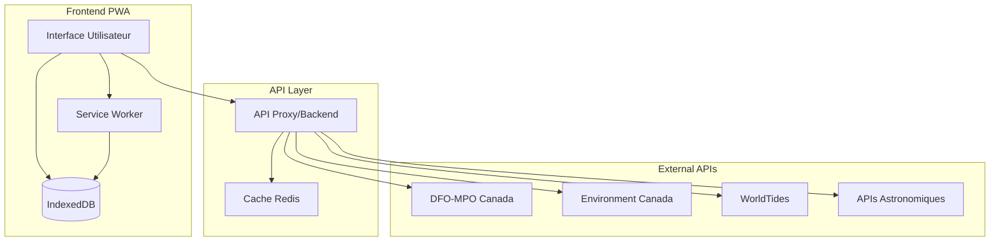
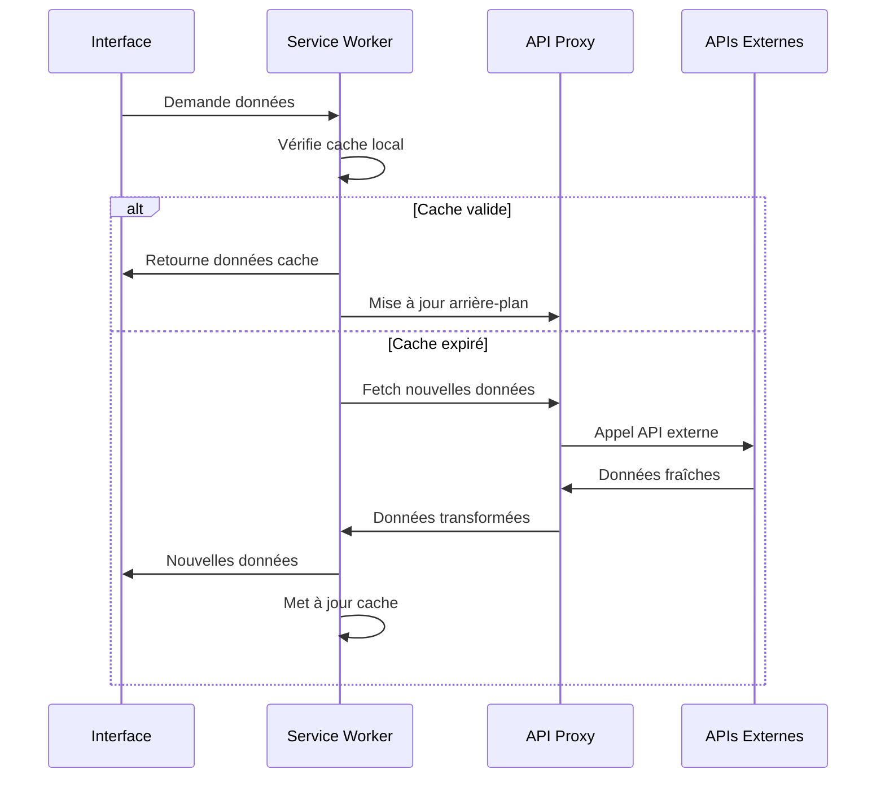

# Architecture Système et Structure des Données

## Vue d'Ensemble de l'Architecture



## Architecture Frontend Détaillée

### 1. Structure des Composants React

```
src/
├── components/
│   ├── tide-clock/
│   │   ├── TideClockContainer.tsx
│   │   ├── TideClockSVG.tsx
│   │   ├── TideHand.tsx
│   │   ├── TideMarkers.tsx
│   │   └── TideInfo.tsx
│   ├── weather/
│   │   ├── WeatherPanel.tsx
│   │   ├── MarineConditions.tsx
│   │   └── WeatherChart.tsx
│   ├── astronomy/
│   │   ├── SunMoonWidget.tsx
│   │   ├── MoonPhase.tsx
│   │   └── SolarTimes.tsx
│   ├── navigation/
│   │   ├── BottomTabs.tsx
│   │   ├── LocationSelector.tsx
│   │   └── SettingsPanel.tsx
│   └── common/
│       ├── LoadingSpinner.tsx
│       ├── ErrorBoundary.tsx
│       └── OfflineIndicator.tsx
├── hooks/
│   ├── useTideData.ts
│   ├── useWeatherData.ts
│   ├── useGeolocation.ts
│   ├── useOfflineSync.ts
│   └── usePWAInstall.ts
├── services/
│   ├── api/
│   │   ├── tideService.ts
│   │   ├── weatherService.ts
│   │   └── astronomyService.ts
│   ├── storage/
│   │   ├── indexedDBService.ts
│   │   └── cacheService.ts
│   └── calculations/
│       ├── tideCalculations.ts
│       ├── astronomyCalculations.ts
│       └── timeUtils.ts
├── store/
│   ├── appStore.ts
│   ├── slices/
│   │   ├── tideSlice.ts
│   │   ├── weatherSlice.ts
│   │   └── settingsSlice.ts
└── types/
    ├── tide.types.ts
    ├── weather.types.ts
    └── app.types.ts
```

### 2. State Management avec Zustand

```typescript
// store/appStore.ts
interface AppStore {
  // Data State
  tides: TideState;
  weather: WeatherState;
  astronomy: AstronomyState;
  locations: LocationState;
  
  // UI State
  ui: UIState;
  
  // Actions
  actions: {
    tides: TideActions;
    weather: WeatherActions;
    astronomy: AstronomyActions;
    ui: UIActions;
  };
}

// Sliced State Example
interface TideState {
  current: CurrentTideData | null;
  predictions: TidePrediction[];
  extremes: TideExtreme[];
  loading: boolean;
  error: string | null;
  lastUpdate: Date | null;
}
```

### 3. Service Worker Architecture

```javascript
// sw.js
importScripts('https://storage.googleapis.com/workbox-cdn/releases/7.0.0/workbox-sw.js');

// Cache Strategies
const strategies = {
  // Static Assets
  staticAssets: new workbox.strategies.CacheFirst({
    cacheName: 'static-assets-v1',
    plugins: [
      new workbox.expiration.ExpirationPlugin({
        maxEntries: 100,
        maxAgeSeconds: 30 * 24 * 60 * 60 // 30 days
      })
    ]
  }),
  
  // API Data
  apiData: new workbox.strategies.StaleWhileRevalidate({
    cacheName: 'api-data-v1',
    plugins: [
      new workbox.expiration.ExpirationPlugin({
        maxEntries: 50,
        maxAgeSeconds: 24 * 60 * 60 // 1 day
      })
    ]
  }),
  
  // Real-time Data
  realTimeData: new workbox.strategies.NetworkFirst({
    cacheName: 'realtime-data-v1',
    networkTimeoutSeconds: 5,
    plugins: [
      new workbox.expiration.ExpirationPlugin({
        maxEntries: 20,
        maxAgeSeconds: 60 * 60 // 1 hour
      })
    ]
  })
};
```

## Backend/API Proxy Architecture

### 1. Structure Vercel Functions

```
api/
├── tides/
│   ├── current.ts
│   ├── predictions.ts
│   └── [stationId].ts
├── weather/
│   ├── current.ts
│   ├── marine.ts
│   └── forecast.ts
├── astronomy/
│   ├── sun.ts
│   ├── moon.ts
│   └── combined.ts
└── locations/
    ├── search.ts
    └── nearby.ts
```

### 2. API Proxy avec Rate Limiting

```typescript
// api/tides/current.ts
import { rateLimit } from '@/lib/rateLimit';
import { cacheResponse } from '@/lib/cache';

export default async function handler(req: VercelRequest, res: VercelResponse) {
  // Rate limiting
  const rateLimitResult = await rateLimit(req);
  if (!rateLimitResult.success) {
    return res.status(429).json({ error: 'Rate limit exceeded' });
  }
  
  // Cache check
  const cacheKey = `tides:current:${req.query.location}`;
  const cached = await getFromCache(cacheKey);
  if (cached) {
    return res.json(cached);
  }
  
  try {
    // Fetch from DFO API
    const tideData = await fetchDFOTides(req.query.location as string);
    
    // Transform data
    const normalizedData = normalizeTideData(tideData);
    
    // Cache response (15 minutes)
    await cacheResponse(cacheKey, normalizedData, 15 * 60);
    
    res.json(normalizedData);
  } catch (error) {
    // Fallback to backup API
    const fallbackData = await fetchWorldTides(req.query.location as string);
    res.json(fallbackData);
  }
}
```

## Modèle de Données

### 1. Types TypeScript

```typescript
// types/tide.types.ts
interface TideData {
  location: LocationInfo;
  current: CurrentTide;
  predictions: TidePrediction[];
  extremes: TideExtreme[];
  metadata: TideMetadata;
}

interface CurrentTide {
  timestamp: Date;
  height: number; // metres
  trend: 'rising' | 'falling' | 'slack';
  rate: number; // m/hour
  nextExtreme: TideExtreme;
}

interface TidePrediction {
  timestamp: Date;
  height: number;
  type: 'prediction' | 'observation';
}

interface TideExtreme {
  timestamp: Date;
  height: number;
  type: 'high' | 'low';
  coefficient?: number; // 20-120 scale
}

// types/weather.types.ts
interface MarineWeather {
  location: LocationInfo;
  current: CurrentConditions;
  forecast: WeatherForecast[];
  marine: MarineConditions;
}

interface MarineConditions {
  waveHeight: number; // metres
  wavePeriod: number; // seconds
  waveDirection: number; // degrees
  windSpeed: number; // km/h
  windDirection: number; // degrees
  windGusts?: number; // km/h
  visibility: number; // km
  waterTemperature?: number; // celsius
  seaState: SeaState;
}

type SeaState = 'calm' | 'smooth' | 'slight' | 'moderate' | 'rough' | 'very_rough' | 'high' | 'very_high';

// types/astronomy.types.ts
interface AstronomyData {
  location: LocationInfo;
  date: Date;
  sun: SolarData;
  moon: LunarData;
  tideInfluence: TideInfluence;
}

interface SolarData {
  sunrise: Date;
  sunset: Date;
  solarNoon: Date;
  civilTwilight: {
    dawn: Date;
    dusk: Date;
  };
  nauticalTwilight: {
    dawn: Date;
    dusk: Date;
  };
  astronomicalTwilight: {
    dawn: Date;
    dusk: Date;
  };
  dayLength: number; // hours
  solarElevation: number; // degrees
}

interface LunarData {
  phase: MoonPhase;
  illumination: number; // 0-1
  age: number; // days since new moon
  rise: Date | null;
  set: Date | null;
  meridian: Date;
  distance: number; // km from Earth
}

interface TideInfluence {
  lunarCoefficient: number; // 0-1
  solarCoefficient: number; // 0-1
  springNeap: 'spring' | 'neap' | 'transitioning';
  syzygyDate: Date; // next new/full moon
}
```

### 2. IndexedDB Schema

```typescript
// services/storage/indexedDBService.ts
const DB_NAME = 'TideClockDB';
const DB_VERSION = 1;

const stores = {
  tides: {
    keyPath: 'id',
    autoIncrement: true,
    indexes: [
      { name: 'timestamp', keyPath: 'timestamp', unique: false },
      { name: 'location', keyPath: 'locationId', unique: false },
      { name: 'date', keyPath: 'date', unique: false }
    ]
  },
  weather: {
    keyPath: 'id',
    autoIncrement: true,
    indexes: [
      { name: 'timestamp', keyPath: 'timestamp', unique: false },
      { name: 'location', keyPath: 'locationId', unique: false },
      { name: 'forecastTime', keyPath: 'forecastTime', unique: false }
    ]
  },
  locations: {
    keyPath: 'id',
    autoIncrement: false,
    indexes: [
      { name: 'name', keyPath: 'name', unique: false },
      { name: 'coordinates', keyPath: ['latitude', 'longitude'], unique: true }
    ]
  },
  settings: {
    keyPath: 'key',
    autoIncrement: false
  },
  cache: {
    keyPath: 'key',
    autoIncrement: false,
    indexes: [
      { name: 'expiry', keyPath: 'expiry', unique: false }
    ]
  }
};
```

## Architecture de Synchronisation

### 1. Stratégie de Synchronisation



### 2. Background Sync Implementation

```typescript
// services/backgroundSync.ts
class BackgroundSyncService {
  private syncQueue: SyncTask[] = [];
  
  async scheduleSync(task: SyncTask) {
    this.syncQueue.push(task);
    
    if ('serviceWorker' in navigator && 'sync' in window.ServiceWorkerRegistration.prototype) {
      const registration = await navigator.serviceWorker.ready;
      await registration.sync.register(task.tag);
    } else {
      // Fallback for browsers without background sync
      this.executeSyncFallback(task);
    }
  }
  
  async executePendingSyncs() {
    for (const task of this.syncQueue) {
      try {
        await this.executeSync(task);
        this.removeFromQueue(task);
      } catch (error) {
        console.error('Sync failed:', error);
        // Retry logic here
      }
    }
  }
}

// Types for sync tasks
interface SyncTask {
  tag: string;
  type: 'tides' | 'weather' | 'astronomy';
  locationId: string;
  priority: 'high' | 'medium' | 'low';
  retryCount: number;
  maxRetries: number;
}
```

## Calculs Hors-ligne

### 1. Algorithmes de Marées Harmoniques

```typescript
// services/calculations/tideCalculations.ts
class TideCalculator {
  private harmonicConstants: HarmonicConstant[];
  
  constructor(stationConstants: HarmonicConstant[]) {
    this.harmonicConstants = stationConstants;
  }
  
  calculateTideHeight(timestamp: Date): number {
    let height = 0;
    const t = this.getTimeInHours(timestamp);
    
    for (const constant of this.harmonicConstants) {
      const phase = constant.speed * t + constant.phase;
      height += constant.amplitude * Math.cos(phase * Math.PI / 180);
    }
    
    return height;
  }
  
  findNextExtreme(from: Date, type: 'high' | 'low'): TideExtreme {
    // Algorithme de recherche d'extremum
    // Utilise la dérivée des harmoniques
    const step = 6; // minutes
    let current = new Date(from);
    let previousHeight = this.calculateTideHeight(current);
    let previousTrend = null;
    
    while (true) {
      current = new Date(current.getTime() + step * 60 * 1000);
      const currentHeight = this.calculateTideHeight(current);
      const currentTrend = currentHeight > previousHeight ? 'rising' : 'falling';
      
      if (previousTrend && previousTrend !== currentTrend) {
        const extremeType = previousTrend === 'rising' ? 'high' : 'low';
        if (type === extremeType) {
          return {
            timestamp: new Date(current.getTime() - step * 60 * 1000),
            height: previousHeight,
            type: extremeType
          };
        }
      }
      
      previousHeight = currentHeight;
      previousTrend = currentTrend;
    }
  }
}

interface HarmonicConstant {
  name: string; // M2, S2, N2, K1, O1, etc.
  amplitude: number; // metres
  phase: number; // degrees
  speed: number; // degrees per hour
}
```

### 2. Calculs Astronomiques

```typescript
// services/calculations/astronomyCalculations.ts
class AstronomyCalculator {
  static calculateSunPosition(date: Date, latitude: number, longitude: number) {
    const julian = this.getJulianDate(date);
    const n = julian - 2451545.0;
    
    // Mean longitude of the Sun
    const L = (280.460 + 0.9856474 * n) % 360;
    
    // Mean anomaly of the Sun
    const g = ((357.528 + 0.9856003 * n) % 360) * Math.PI / 180;
    
    // Ecliptic longitude
    const lambda = (L + 1.915 * Math.sin(g) + 0.020 * Math.sin(2 * g)) * Math.PI / 180;
    
    // Calculate sun elevation and azimuth
    return this.calculateSolarPosition(lambda, date, latitude, longitude);
  }
  
  static calculateMoonPhase(date: Date): MoonPhase {
    const julian = this.getJulianDate(date);
    const daysSinceNew = (julian - 2451549.5) % 29.53058867;
    
    if (daysSinceNew < 1.84566) return 'new';
    else if (daysSinceNew < 5.53699) return 'waxing_crescent';
    else if (daysSinceNew < 9.22831) return 'first_quarter';
    else if (daysSinceNew < 12.91963) return 'waxing_gibbous';
    else if (daysSinceNew < 16.61096) return 'full';
    else if (daysSinceNew < 20.30228) return 'waning_gibbous';
    else if (daysSinceNew < 23.99361) return 'last_quarter';
    else return 'waning_crescent';
  }
}
```

## Performance et Optimisation

### 1. Lazy Loading Strategy

```typescript
// utils/lazyLoading.ts
const componentMap = {
  TideChart: () => import('../components/charts/TideChart'),
  WeatherChart: () => import('../components/charts/WeatherChart'),
  SettingsPanel: () => import('../components/settings/SettingsPanel'),
  LocationPicker: () => import('../components/location/LocationPicker')
};

export const lazyLoad = (componentName: keyof typeof componentMap) => {
  return React.lazy(componentMap[componentName]);
};
```

### 2. Memoization Strategy

```typescript
// hooks/useMemoizedCalculations.ts
export const useMemoizedTideCalculations = (location: Location, dateRange: DateRange) => {
  return useMemo(() => {
    const calculator = new TideCalculator(location.harmonicConstants);
    return generateTidePredictions(calculator, dateRange);
  }, [location.id, dateRange.start, dateRange.end]);
};

export const useMemoizedClockData = (currentTide: CurrentTide, timeFormat: TimeFormat) => {
  return useMemo(() => {
    return {
      angle: calculateTideAngle(currentTide),
      displayTime: formatTime(currentTide.timestamp, timeFormat),
      heightText: formatHeight(currentTide.height)
    };
  }, [currentTide.timestamp, currentTide.height, timeFormat]);
};
```

## Gestion d'Erreurs et Resilience

### 1. Error Boundary avec Fallback

```typescript
// components/common/TideErrorBoundary.tsx
class TideErrorBoundary extends Component<Props, State> {
  state = { hasError: false, error: null };
  
  static getDerivedStateFromError(error: Error) {
    return { hasError: true, error };
  }
  
  componentDidCatch(error: Error, errorInfo: ErrorInfo) {
    // Log to monitoring service
    console.error('Tide app error:', error, errorInfo);
    
    // Try to recover data from cache
    this.attemptRecovery();
  }
  
  attemptRecovery = async () => {
    try {
      const cachedData = await getCachedTideData();
      if (cachedData) {
        this.setState({ hasError: false, error: null });
      }
    } catch (recoveryError) {
      // Show offline mode
      this.showOfflineMode();
    }
  };
  
  render() {
    if (this.state.hasError) {
      return <TideErrorFallback error={this.state.error} onRetry={this.attemptRecovery} />;
    }
    
    return this.props.children;
  }
}
```

### 2. Network Resilience

```typescript
// services/networkResilience.ts
export class NetworkResilienceService {
  private retryAttempts = new Map<string, number>();
  private maxRetries = 3;
  private retryDelay = 1000; // ms
  
  async fetchWithRetry<T>(url: string, options: RequestInit = {}): Promise<T> {
    const attempts = this.retryAttempts.get(url) || 0;
    
    try {
      const response = await fetch(url, {
        ...options,
        timeout: 10000 // 10 second timeout
      });
      
      if (!response.ok) {
        throw new Error(`HTTP ${response.status}`);
      }
      
      // Reset retry counter on success
      this.retryAttempts.delete(url);
      return await response.json();
      
    } catch (error) {
      if (attempts < this.maxRetries) {
        this.retryAttempts.set(url, attempts + 1);
        await this.delay(this.retryDelay * Math.pow(2, attempts));
        return this.fetchWithRetry(url, options);
      }
      
      // All retries exhausted, try fallback
      return this.tryFallbackSource(url);
    }
  }
  
  private async tryFallbackSource<T>(originalUrl: string): Promise<T> {
    const fallbackUrls = this.getFallbackUrls(originalUrl);
    
    for (const fallbackUrl of fallbackUrls) {
      try {
        const response = await fetch(fallbackUrl);
        if (response.ok) {
          return await response.json();
        }
      } catch (error) {
        continue;
      }
    }
    
    throw new Error('All API sources failed');
  }
}
```

Cette architecture fournit une base solide pour une application PWA complète, performante et résiliente, avec une gestion appropriée des données hors-ligne et des calculs de secours.