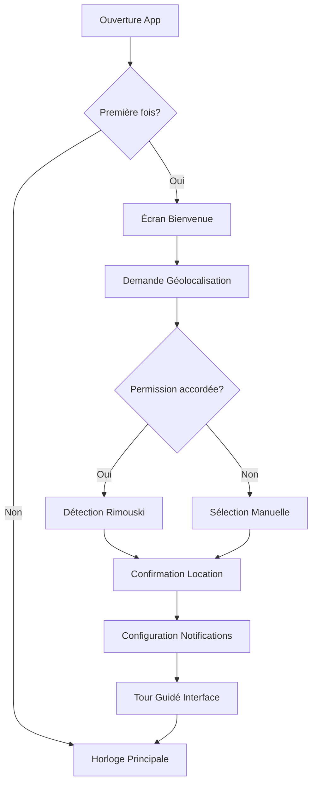
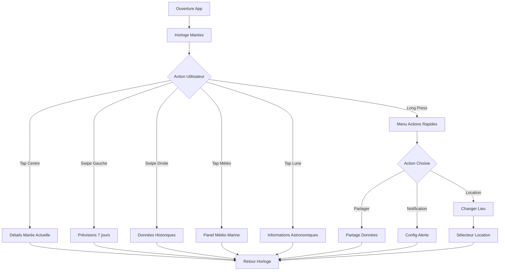

# Expérience Utilisateur et Interface (UX/UI)

## Vision Produit et Personas

### 1. Vision de l'Application
**"Une horloge des marées intuitive et complète qui permet aux utilisateurs de comprendre et anticiper les cycles de marées avec élégance et précision."**

### 2. Personas Cibles

#### Persona Principal: Le Marin Récréatif
- **Nom**: Marc, 45 ans
- **Contexte**: Propriétaire d'un voilier à Rimouski
- **Besoins**: Planifier ses sorties en mer, connaître les conditions actuelles
- **Contraintes**: Utilise souvent son téléphone en extérieur, besoin d'infos rapides
- **Goals**: Sécurité en mer, optimisation des sorties

#### Persona Secondaire: L'Observateur Nature
- **Nom**: Catherine, 32 ans
- **Contexte**: Photographe nature, passionnée d'astronomie
- **Besoins**: Correlation marées/lune, planification photos lever/coucher
- **Contraintes**: Utilise tablette et mobile, travaille souvent à l'aube/crépuscule
- **Goals**: Capture des meilleurs moments, compréhension des cycles naturels

## User Journey et Flux d'Interaction

### 1. Premier Lancement (Onboarding)



### 2. Utilisation Quotidienne



## Design System et Identité Visuelle

### 1. Palette de Couleurs

```css
:root {
  /* Couleurs Principales */
  --ocean-blue: #1e40af;
  --tide-teal: #0891b2;
  --wave-cyan: #06b6d4;
  --foam-white: #f0f9ff;
  
  /* Couleurs Marées */
  --high-tide: #059669; /* Vert */
  --low-tide: #dc2626;  /* Rouge */
  --rising-tide: #2563eb; /* Bleu */
  --falling-tide: #7c3aed; /* Violet */
  
  /* Couleurs Astronomiques */
  --sun-gold: #f59e0b;
  --moon-silver: #94a3b8;
  --star-light: #fbbf24;
  
  /* Interface */
  --background-light: #ffffff;
  --background-dark: #0f172a;
  --text-primary: #1e293b;
  --text-secondary: #64748b;
  --border-subtle: #e2e8f0;
  
  /* États */
  --success: #10b981;
  --warning: #f59e0b;
  --error: #ef4444;
  --info: #3b82f6;
}
```

### 2. Typographie

```css
/* Système Typographique */
@import url('https://fonts.googleapis.com/css2?family=Inter:wght@300;400;500;600;700&display=swap');

:root {
  /* Tailles */
  --text-xs: 0.75rem;   /* 12px */
  --text-sm: 0.875rem;  /* 14px */
  --text-base: 1rem;    /* 16px */
  --text-lg: 1.125rem;  /* 18px */
  --text-xl: 1.25rem;   /* 20px */
  --text-2xl: 1.5rem;   /* 24px */
  --text-3xl: 1.875rem; /* 30px */
  --text-4xl: 2.25rem;  /* 36px */
  
  /* Weights */
  --font-light: 300;
  --font-normal: 400;
  --font-medium: 500;
  --font-semibold: 600;
  --font-bold: 700;
  
  /* Line Heights */
  --leading-tight: 1.25;
  --leading-normal: 1.5;
  --leading-relaxed: 1.625;
}

.font-display {
  font-family: 'Inter', -apple-system, BlinkMacSystemFont, sans-serif;
  font-weight: var(--font-semibold);
  letter-spacing: -0.025em;
}

.font-body {
  font-family: 'Inter', -apple-system, BlinkMacSystemFont, sans-serif;
  font-weight: var(--font-normal);
}
```

### 3. Composants de Base

```css
/* Boutons */
.btn-primary {
  background: linear-gradient(135deg, var(--ocean-blue), var(--tide-teal));
  color: white;
  border-radius: 12px;
  padding: 12px 24px;
  font-weight: var(--font-medium);
  transition: all 0.2s ease;
}

.btn-primary:hover {
  transform: translateY(-1px);
  box-shadow: 0 8px 25px rgba(30, 64, 175, 0.3);
}

/* Cards */
.card {
  background: var(--background-light);
  border-radius: 16px;
  padding: 24px;
  box-shadow: 0 4px 6px rgba(0, 0, 0, 0.05);
  border: 1px solid var(--border-subtle);
}

/* Animations */
@keyframes tidePulse {
  0%, 100% { opacity: 1; }
  50% { opacity: 0.7; }
}

@keyframes waveFlow {
  0% { transform: translateX(-100%); }
  100% { transform: translateX(100%); }
}
```

## Interface Horloge Circulaire

### 1. Concept de l'Horloge

```
     12h (Marée Haute)
           │
           │
    9h ────┼──── 3h
           │
           │
     6h (Marée Basse)

Principe:
- 12h00 = Marée haute
- 6h00 = Marée basse  
- Aiguille indique position actuelle
- Couleur de l'aiguille = tendance
- Zone colorée = prochaine marée
```

### 2. Éléments Visuels de l'Horloge

```typescript
interface ClockElements {
  // Cercle principal
  outerRing: {
    radius: number;
    strokeWidth: 4;
    color: 'var(--tide-teal)';
  };
  
  // Graduations heures
  hourMarkers: {
    count: 12;
    length: 12;
    width: 2;
    color: 'var(--text-secondary)';
  };
  
  // Graduations marées
  tideMarkers: {
    high: { position: '12h', color: 'var(--high-tide)', size: 'large' };
    low: { position: '6h', color: 'var(--low-tide)', size: 'large' };
  };
  
  // Aiguille principale
  tideHand: {
    length: '70%';
    width: 3;
    color: 'dynamic'; // Basé sur la tendance
    animation: 'smooth-rotation';
  };
  
  // Centre avec informations
  centerInfo: {
    currentHeight: string;
    trend: TideTrend;
    timeToNext: string;
  };
}
```

### 3. Animations et Transitions

```css
/* Animation de l'aiguille */
.tide-hand {
  transform-origin: center bottom;
  transition: transform 1s cubic-bezier(0.4, 0, 0.2, 1);
}

/* Pulsation pour marée haute/basse */
.tide-extreme {
  animation: tidePulse 2s ease-in-out infinite;
}

/* Effet de vague sur le bord */
.wave-border::before {
  content: '';
  position: absolute;
  top: -2px;
  left: 0;
  right: 0;
  height: 4px;
  background: linear-gradient(90deg, transparent, var(--wave-cyan), transparent);
  animation: waveFlow 3s ease-in-out infinite;
}

/* Rotation fluide */
@keyframes smoothRotation {
  from { transform: rotate(var(--start-angle)); }
  to { transform: rotate(var(--end-angle)); }
}
```

## Layout et Navigation

### 1. Structure de l'Écran Principal

```
┌─────────────────────────────┐
│        Status Bar           │ ← Heure, batterie, réseau
├─────────────────────────────┤
│     Location & Weather      │ ← Rimouski, QC • 4°C ☁️
├─────────────────────────────┤
│                             │
│       🌊 HORLOGE 🌊         │ ← Horloge circulaire principale
│         MARÉES             │
│                             │
├─────────────────────────────┤
│  [Sun] [Tide] [Moon] [More] │ ← Widgets rapides
├─────────────────────────────┤
│     Prochaine Marée        │ ← Informations détaillées
│   ▲ Haute: 14:32 (3.2m)    │
├─────────────────────────────┤
│ [●] [Prév] [Hist] [⚙️]     │ ← Navigation bottom tabs
└─────────────────────────────┘
```

### 2. Navigation par Gestes

```typescript
// Gestes supportés
interface GestureHandlers {
  // Horloge principale
  clockTap: () => void;           // Affiche détails
  clockLongPress: () => void;     // Menu actions
  clockPinch: (scale: number) => void; // Zoom sur période
  
  // Navigation
  swipeLeft: () => void;          // Prévisions futures
  swipeRight: () => void;         // Historique
  swipeUp: () => void;           // Panel météo complet
  swipeDown: () => void;         // Actualisation
  
  // Widgets
  doubleTab: () => void;         // Mode plein écran
  threeFingerTap: () => void;    // Partage rapide
}
```

### 3. Responsive Design

```css
/* Mobile Portrait (320px - 768px) */
@media (max-width: 768px) and (orientation: portrait) {
  .tide-clock {
    width: min(85vw, 85vh);
    height: min(85vw, 85vh);
  }
  
  .bottom-tabs {
    position: fixed;
    bottom: 0;
    height: 60px;
  }
}

/* Mobile Landscape (568px - 1024px) */
@media (max-width: 1024px) and (orientation: landscape) {
  .main-layout {
    flex-direction: row;
  }
  
  .tide-clock {
    width: min(60vh, 60vw);
    height: min(60vh, 60vw);
  }
  
  .side-panels {
    width: 300px;
    display: flex;
    flex-direction: column;
  }
}

/* Tablet (768px - 1024px) */
@media (min-width: 768px) and (max-width: 1024px) {
  .tide-clock {
    width: min(50vw, 50vh);
    height: min(50vw, 50vh);
  }
  
  .info-panels {
    display: grid;
    grid-template-columns: 1fr 1fr;
    gap: 16px;
  }
}

/* Desktop (1024px+) */
@media (min-width: 1024px) {
  .app-layout {
    max-width: 1200px;
    margin: 0 auto;
    display: grid;
    grid-template-columns: 1fr 400px 1fr;
    grid-template-areas: 
      "weather clock astronomy"
      "tides clock forecast";
  }
  
  .tide-clock {
    grid-area: clock;
    width: 400px;
    height: 400px;
  }
}
```

## États et Feedback Utilisateur

### 1. États de Chargement

```typescript
interface LoadingStates {
  initial: {
    skeleton: 'clock-outline';
    message: 'Chargement des données de marées...';
    duration: '2-5s';
  };
  
  refresh: {
    indicator: 'subtle-spinner';
    location: 'top-bar';
    message: 'Mise à jour...';
  };
  
  offline: {
    banner: 'Mode hors-ligne';
    color: 'warning';
    action: 'Réessayer';
  };
  
  error: {
    fallback: 'Données approximatives';
    color: 'error';
    action: 'Actualiser';
  };
}
```

### 2. Animations de Transition

```css
/* Transition entre vues */
.view-transition {
  animation: slideIn 0.3s cubic-bezier(0.4, 0, 0.2, 1);
}

@keyframes slideIn {
  from {
    transform: translateX(100%);
    opacity: 0;
  }
  to {
    transform: translateX(0);
    opacity: 1;
  }
}

/* Feedback tactile visuel */
.interactive-element {
  transition: all 0.1s ease;
}

.interactive-element:active {
  transform: scale(0.98);
  opacity: 0.8;
}

/* Indicateur de données en temps réel */
.live-indicator {
  position: relative;
}

.live-indicator::after {
  content: '';
  position: absolute;
  top: 4px;
  right: 4px;
  width: 8px;
  height: 8px;
  background: var(--success);
  border-radius: 50%;
  animation: pulse 2s infinite;
}

@keyframes pulse {
  0% { opacity: 1; }
  50% { opacity: 0.5; }
  100% { opacity: 1; }
}
```

### 3. Messages et Notifications

```typescript
interface NotificationTypes {
  tideAlert: {
    title: 'Marée Haute dans 30 min';
    body: 'Hauteur prévue: 3.2m à Rimouski';
    icon: '🌊';
    actions: ['Voir détails', 'Reporter'];
  };
  
  weatherWarning: {
    title: 'Avis de Vent Fort';
    body: 'Vents de 45 km/h prévus cet après-midi';
    icon: '⚠️';
    priority: 'high';
  };
  
  moonPhase: {
    title: 'Pleine Lune ce soir';
    body: 'Marées de vive-eau prévues';
    icon: '🌕';
    scheduled: true;
  };
}
```

## Accessibilité et Inclusivité

### 1. Standards WCAG 2.1 AA

```css
/* Contraste minimum */
.high-contrast {
  --text-contrast-ratio: 7:1; /* AAA level */
  --background-contrast: 4.5:1; /* AA level */
}

/* Focus visible */
.focusable:focus {
  outline: 2px solid var(--focus-color);
  outline-offset: 2px;
  border-radius: 4px;
}

/* Texte lisible */
.readable-text {
  font-size: clamp(16px, 2.5vw, 18px);
  line-height: 1.5;
  letter-spacing: 0.5px;
}

/* Mode sombre accessible */
@media (prefers-color-scheme: dark) {
  :root {
    --background-light: #0f172a;
    --background-dark: #ffffff;
    --text-primary: #f1f5f9;
    --text-secondary: #cbd5e1;
  }
}

/* Réduction des animations */
@media (prefers-reduced-motion: reduce) {
  *, *::before, *::after {
    animation-duration: 0.01ms !important;
    animation-iteration-count: 1 !important;
    transition-duration: 0.01ms !important;
  }
}
```

### 2. Support Clavier

```typescript
// Navigation clavier
const keyboardHandlers = {
  'Tab': focusNext,
  'Shift+Tab': focusPrevious,
  'Enter': activateElement,
  'Space': toggleElement,
  'Escape': closeModal,
  'ArrowLeft': navigatePrevious,
  'ArrowRight': navigateNext,
  'ArrowUp': increaseValue,
  'ArrowDown': decreaseValue,
  'Home': goToFirst,
  'End': goToLast,
  '1-9': quickNavigate
};
```

### 3. Lecteurs d'Écran

```html
<!-- ARIA Labels pour l'horloge -->
<div
  role="img"
  aria-label="Horloge des marées montrant marée actuelle à 2.3 mètres, en hausse, prochaine marée haute à 14h32"
  aria-describedby="tide-details"
>
  <svg>
    <circle aria-hidden="true" />
    <line
      aria-label="Aiguille des marées pointant vers 10h20"
      role="presentation"
    />
  </svg>
</div>

<div id="tide-details" class="sr-only">
  Marée actuelle: 2.3 mètres, en hausse de 0.2 mètres par heure.
  Prochaine marée haute prévue à 14 heures 32 avec une hauteur de 3.2 mètres.
  Coefficient de marée: 85 sur 120.
</div>
```

## Modes d'Affichage Spécialisés

### 1. Mode Plein Écran

```css
.fullscreen-mode {
  position: fixed;
  top: 0;
  left: 0;
  width: 100vw;
  height: 100vh;
  z-index: 9999;
  background: var(--background-light);
}

.fullscreen-clock {
  width: min(90vw, 90vh);
  height: min(90vw, 90vh);
  margin: auto;
  position: absolute;
  top: 50%;
  left: 50%;
  transform: translate(-50%, -50%);
}

.fullscreen-controls {
  position: absolute;
  bottom: 20px;
  left: 50%;
  transform: translateX(-50%);
  display: flex;
  gap: 16px;
}
```

### 2. Mode Tableau de Bord

```css
.dashboard-mode {
  display: grid;
  grid-template-areas:
    "current-tide weather moon"
    "tide-chart tide-chart tide-chart"
    "next-tides astronomy alerts";
  grid-template-columns: 1fr 1fr 1fr;
  grid-template-rows: auto 300px auto;
  gap: 16px;
  padding: 16px;
}

.current-tide { grid-area: current-tide; }
.weather { grid-area: weather; }
.moon { grid-area: moon; }
.tide-chart { grid-area: tide-chart; }
.next-tides { grid-area: next-tides; }
.astronomy { grid-area: astronomy; }
.alerts { grid-area: alerts; }
```

### 3. Mode Widget/Compact

```css
.widget-mode {
  width: 200px;
  height: 200px;
  border-radius: 16px;
  padding: 12px;
  background: linear-gradient(135deg, var(--ocean-blue), var(--tide-teal));
  color: white;
  position: relative;
}

.widget-clock {
  width: 120px;
  height: 120px;
  margin: 0 auto;
}

.widget-info {
  position: absolute;
  bottom: 12px;
  left: 12px;
  right: 12px;
  text-align: center;
  font-size: var(--text-sm);
}
```

## Personnalisation et Préférences

### 1. Thèmes Disponibles

```typescript
interface ThemeOptions {
  classic: {
    name: 'Classique Océan';
    colors: defaultColors;
    clockStyle: 'traditional';
  };
  
  minimalist: {
    name: 'Minimaliste';
    colors: monochromeColors;
    clockStyle: 'clean';
  };
  
  nautical: {
    name: 'Nautique';
    colors: nauticalColors;
    clockStyle: 'maritime';
  };
  
  sunset: {
    name: 'Coucher de Soleil';
    colors: warmColors;
    clockStyle: 'warm';
  };
}
```

### 2. Options de Configuration

```typescript
interface UserPreferences {
  // Affichage
  theme: ThemeOptions;
  language: 'fr' | 'en';
  units: {
    height: 'meters' | 'feet';
    speed: 'kmh' | 'knots';
    temperature: 'celsius' | 'fahrenheit';
  };
  
  // Notifications
  alerts: {
    highTide: boolean;
    lowTide: boolean;
    extremeTides: boolean;
    weatherWarnings: boolean;
    beforeTime: number; // minutes
  };
  
  // Interface
  clockSize: 'small' | 'medium' | 'large';
  showSeconds: boolean;
  show24Hour: boolean;
  compactMode: boolean;
  
  // Données
  forecastDays: 3 | 7 | 14;
  updateFrequency: 5 | 15 | 30; // minutes
  offlineMode: boolean;
}
```

## Performance UX

### 1. Optimisations Perçues

```typescript
// Chargement progressif
const loadingStrategy = {
  immediate: ['clock-skeleton', 'current-time'],
  fast: ['current-tide', 'trend'], // < 500ms
  medium: ['next-tides', 'weather'], // < 2s
  slow: ['charts', 'astronomy'], // < 5s
  background: ['historical-data', 'extended-forecast']
};

// Pré-chargement intelligent
const preloadRules = {
  onAppStart: ['today-tides', 'current-weather'],
  onLocationChange: ['new-location-tides'],
  onUserInteraction: ['detail-views'],
  onTimeUpdate: ['upcoming-extremes']
};
```

### 2. Feedback Instantané

```css
/* Feedback tactile immédiat */
.instant-feedback {
  transform: scale(1);
  transition: transform 0.1s ease;
}

.instant-feedback:active {
  transform: scale(0.95);
}

/* Loading states */
.loading-skeleton {
  background: linear-gradient(90deg, #f0f0f0 25%, #e0e0e0 50%, #f0f0f0 75%);
  background-size: 200% 100%;
  animation: skeleton-loading 1.5s infinite;
}

@keyframes skeleton-loading {
  0% { background-position: 200% 0; }
  100% { background-position: -200% 0; }
}
```

Cette approche UX complète assure une expérience utilisateur fluide, accessible et engageante pour l'application d'horloge des marées.