# Maquettes et Spécifications de l'Interface Circulaire

## Vue d'Ensemble du Design

### 1. Concept Visual de l'Horloge des Marées

```
                    🌊 MARÉE HAUTE 🌊
                           12
                           │
                      11   │   1
                         \ │ /
                    10 ────┼──── 2
                         / │ \
                      9    │    3
                           │
                    8 ────┼──── 4
                         \ │ /
                      7    │    5
                           │
                           6
                    🌊 MARÉE BASSE 🌊

    Centre de l'horloge:
    ┌─────────────────┐
    │    2.3m ↗      │  ← Hauteur actuelle + tendance
    │   Montante     │  ← État de la marée
    │   14:32 ▲     │  ← Prochaine marée haute
    └─────────────────┘
```

### 2. Anatomie Détaillée de l'Interface

```mermaid
graph TD
    A[Conteneur Principal] --> B[Cercle Extérieur]
    A --> C[Graduations Heures]
    A --> D[Marqueurs Marées]
    A --> E[Aiguille Principale]
    A --> F[Zone Centrale Info]
    A --> G[Indicateurs Secondaires]
    
    B --> B1[Border: 4px, Teal]
    B --> B2[Animation: Pulse sur extremes]
    
    C --> C1[12 graduations]
    C --> C2[Styles: Heures vs Minutes]
    
    D --> D1[Marqueur Haute: 12h]
    D --> D2[Marqueur Basse: 6h]
    D --> D3[Couleurs dynamiques]
    
    E --> E1[Longueur: 70% rayon]
    E --> E2[Couleur: Basée tendance]
    E --> E3[Animation: Rotation fluide]
    
    F --> F1[Hauteur actuelle]
    F --> F2[Tendance avec icône]
    F --> F3[Temps jusqu'à extrême]
    
    G --> G1[Coefficient marée]
    G --> G2[Phase lunaire]
    G --> G3[Conditions météo]
```



## Spécifications Techniques SVG

### 1. Structure SVG Base

```xml
<svg 
  width="400" 
  height="400" 
  viewBox="0 0 400 400" 
  xmlns="http://www.w3.org/2000/svg"
  class="tide-clock"
  role="img"
  aria-label="Horloge des marées"
>
  <!-- Définitions des gradients et filtres -->
  <defs>
    <!-- Gradient pour le cercle principal -->
    <linearGradient id="tideGradient" x1="0%" y1="0%" x2="100%" y2="100%">
      <stop offset="0%" style="stop-color:#0891b2;stop-opacity:1" />
      <stop offset="100%" style="stop-color:#06b6d4;stop-opacity:1" />
    </linearGradient>
    
    <!-- Filtre pour l'ombre portée -->
    <filter id="dropShadow" x="-50%" y="-50%" width="200%" height="200%">
      <feDropShadow dx="2" dy="2" stdDeviation="3" flood-opacity="0.3"/>
    </filter>
    
    <!-- Gradient pour l'aiguille selon tendance -->
    <linearGradient id="risingTide" x1="0%" y1="0%" x2="0%" y2="100%">
      <stop offset="0%" style="stop-color:#2563eb;stop-opacity:1" />
      <stop offset="100%" style="stop-color:#1e40af;stop-opacity:1" />
    </linearGradient>
    
    <linearGradient id="fallingTide" x1="0%" y1="0%" x2="0%" y2="100%">
      <stop offset="0%" style="stop-color:#7c3aed;stop-opacity:1" />
      <stop offset="100%" style="stop-color:#5b21b6;stop-opacity:1" />
    </linearGradient>
  </defs>
  
  <!-- Cercle de fond -->
  <circle 
    cx="200" 
    cy="200" 
    r="180" 
    fill="none" 
    stroke="url(#tideGradient)" 
    stroke-width="4"
    filter="url(#dropShadow)"
  />
  
  <!-- Graduations et marqueurs -->
  <g class="hour-markers">
    <!-- Générés dynamiquement -->
  </g>
  
  <!-- Aiguille des marées -->
  <g class="tide-hand" transform-origin="200 200">
    <line 
      x1="200" 
      y1="200" 
      x2="200" 
      y2="80" 
      stroke="url(#risingTide)" 
      stroke-width="3"
      stroke-linecap="round"
    />
    <circle cx="200" cy="200" r="8" fill="url(#risingTide)" />
  </g>
  
  <!-- Zone centrale d'informations -->
  <g class="center-info">
    <!-- Contenu textuel positionné absolument -->
  </g>
</svg>
```

### 2. Calculs de Positionnement

```typescript
interface ClockGeometry {
  center: { x: 200, y: 200 };
  radius: 180;
  
  // Calcul des positions d'heures
  getHourPosition(hour: number): { x: number, y: number } {
    const angle = (hour * 30 - 90) * Math.PI / 180; // -90 pour commencer à 12h
    return {
      x: this.center.x + Math.cos(angle) * this.radius,
      y: this.center.y + Math.sin(angle) * this.radius
    };
  }
  
  // Calcul de l'angle de l'aiguille
  getTideAngle(tidePosition: number): number {
    // tidePosition: 0-1 où 0 = marée basse, 1 = marée haute
    return (tidePosition * 180) - 90; // -90° (6h) à +90° (12h)
  }
  
  // Calcul de position pour graduations
  getMarkerPosition(angle: number, innerRadius: number, outerRadius: number) {
    const radian = angle * Math.PI / 180;
    return {
      x1: this.center.x + Math.cos(radian) * innerRadius,
      y1: this.center.y + Math.sin(radian) * innerRadius,
      x2: this.center.x + Math.cos(radian) * outerRadius,
      y2: this.center.y + Math.sin(radian) * outerRadius
    };
  }
}
```

## Maquettes par Taille d'Écran

### 1. Mobile Portrait (375x667px)

```
┌─────────────────────────────────┐
│ ☰ Rimouski, QC    🔋██ 📶███   │ ← Header compact
├─────────────────────────────────┤
│                                 │
│        🌊 HORLOGE 🌊           │
│     ┌─────────────────┐         │
│     │       12        │         │
│     │   11     1      │         │
│     │ 10   ●─── 2     │ ← 320px │
│     │   9     3       │   horloge│
│     │     8 4         │         │
│     │       6         │         │
│     └─────────────────┘         │
│                                 │
│      2.3m ↗ Montante           │ ← Info principale
│    Prochaine: 14:32 ▲ 3.2m     │
├─────────────────────────────────┤
│ 🌤️ 4°C  🌙 🌗  ⚡ 85    📊    │ ← Widgets
├─────────────────────────────────┤
│ [●] [📈] [📅] [⚙️]             │ ← Navigation tabs
└─────────────────────────────────┘
```

### 2. Mobile Landscape (667x375px)

```
┌─────────────────┬─────────────────┐
│   🌊 HORLOGE    │  📊 INFOS       │
│  ┌───────────┐  │                 │
│  │     12    │  │ 📍 Rimouski     │
│  │  11   1   │  │ 🌊 2.3m ↗      │
│  │10  ●─  2  │  │ ⏰ 14:32 ▲     │
│  │  9   3    │  │ 🌤️ 4°C 💨15    │
│  │   8 4     │  │ 🌙 🌗 85%       │
│  │     6     │  │                 │
│  └───────────┘  │ [Détails] [📊]  │
│                 │                 │
│ [●][📈][📅][⚙️] │                 │
└─────────────────┴─────────────────┘
```

### 3. Tablet Portrait (768x1024px)

```
┌─────────────────────────────────┐
│ Horloge des Marées - Rimouski   │ ← Header étendu
├─────────────────────────────────┤
│                                 │
│         🌊 HORLOGE 🌊          │
│      ┌─────────────────┐        │
│      │        12       │        │
│      │    11     1     │        │
│      │  10         2   │ ← 400px│
│      │9      ●───    3 │  horloge│
│      │  8         4    │        │
│      │    7     5      │        │
│      │        6        │        │
│      └─────────────────┘        │
│                                 │
├─────────────────────────────────┤
│ ┌─────────┐ ┌─────────┐ ┌─────────┐ │
│ │🌊 MARÉE │ │🌤️ MÉTÉO│ │🌙 ASTRO│ │ ← Panels info
│ │2.3m ↗  │ │4°C ☁️  │ │🌗 73%  │ │   en grille
│ │14:32 ▲ │ │15km/h  │ │Lever:  │ │
│ │3.2m    │ │Visib:8k│ │06:45   │ │
│ └─────────┘ └─────────┘ └─────────┘ │
├─────────────────────────────────┤
│        📊 GRAPHIQUE 7 JOURS     │ ← Graphique
│   ┌─────────────────────────┐   │   étendu
│   │  ╭─╮                   │   │
│   │ ╱   ╲     ╭─╮           │   │
│   │╱     ╲   ╱   ╲     ╭─╮  │   │
│   │       ╲ ╱     ╲   ╱   ╲ │   │
│   │        ╲╱       ╲ ╱     ╲│   │
│   └─────────────────────────┘   │
├─────────────────────────────────┤
│ [●Actuel] [📈Prév] [📅Hist] [⚙️Param] │
└─────────────────────────────────┘
```

### 4. Desktop (1200px+)

```
┌─────────────────────────────────────────────────────────────┐
│ 🌊 Horloge des Marées         🔍 [Recherche] 👤 Profil      │
├─────────────────────────────────────────────────────────────┤
│                                                             │
│ ┌─────────────┐  ┌─────────────────┐  ┌─────────────┐       │
│ │🌤️ MÉTÉO    │  │   🌊 HORLOGE    │  │🌙 ASTRONOMIE│       │
│ │            │  │       🌊        │  │            │       │
│ │🌡️ 4°C      │  │  ┌───────────┐  │  │🌗 Gibbeuse │       │
│ │💨 15 km/h   │  │  │     12    │  │  │73% éclairée│       │
│ │📊 Visib: 8k │  │  │  11   1   │  │  │            │       │
│ │🌊 Vagues:0.5│  │  │10  ●─  2  │  │  │Lever: 06:45│       │
│ │💧 Temp: 6°C │  │  │  9   3    │  │  │Coucher:    │       │
│ │            │  │  │   8 4     │  │  │  19:32     │       │
│ │[Détails]   │  │  │     6     │  │  │            │       │
│ │[Prévisions]│  │  └───────────┘  │  │[Calendrier]│       │
│ └─────────────┘  │                │  └─────────────┘       │
│                  │   2.3m ↗       │                        │
│ ┌─────────────┐  │   Montante     │  ┌─────────────┐       │
│ │📊 MARÉES    │  │ Proch: 14:32▲  │  │⚙️ CONTRÔLES│       │
│ │            │  └─────────────────┘  │            │       │
│ │Coeff: 85   │                      │🔔 Alertes  │       │
│ │Type: Vive  │                      │📍 Location │       │
│ │            │                      │🎨 Thème    │       │
│ │Suivantes:  │                      │📊 Unités   │       │
│ │14:32 ▲3.2m │                      │💾 Export   │       │
│ │20:15 ▼0.8m │                      │            │       │
│ │            │                      │[Paramètres]│       │
│ └─────────────┘                      └─────────────┘       │
├─────────────────────────────────────────────────────────────┤
│              📈 GRAPHIQUE DÉTAILLÉ 14 JOURS                │
│ ┌─────────────────────────────────────────────────────────┐ │
│
│ │    ╭─╮         ╭─╮              ╭─╮         ╭─╮        │ │
│ │   ╱   ╲       ╱   ╲            ╱   ╲       ╱   ╲       │ │
│ │  ╱     ╲     ╱     ╲          ╱     ╲     ╱     ╲      │ │
│ │ ╱       ╲   ╱       ╲        ╱       ╲   ╱       ╲     │ │
│ │╱         ╲ ╱         ╲      ╱         ╲ ╱         ╲    │ │
│ │           ╲╱           ╲    ╱           ╲╱           ╲   │ │
│ │                        ╲  ╱                         ╲  │ │
│ │                         ╲╱                           ╲ │ │
│ └─────────────────────────────────────────────────────────┘ │
└─────────────────────────────────────────────────────────────┘
```

## États Visuels de l'Horloge

### 1. État Marée Montante

```
     🌊 MARÉE HAUTE 🌊
           12 ●●●
           │
      11   │   1
        \  │  /
   10 ────┼──── 2
        /  │● \    ← Aiguille pointant vers 1h30
     9     │   3     (marée montante)
           │
   8 ─────┼───── 4
        \  │  /
     7    │    5
           │
           6
    🌊 MARÉE BASSE 🌊

Centre:
┌─────────────────┐
│    2.3m ↗      │ ← Flèche montante bleue
│   Montante     │
│   14:32 ▲     │ ← Prochaine haute en vert
└─────────────────┘

Couleurs:
- Aiguille: Bleu (#2563eb)
- Marqueur 12h: Vert pulsant
- Fond: Gradient bleu clair
```

### 2. État Marée Descendante

```
     🌊 MARÉE HAUTE 🌊
           12
           │
      11   │   1
        \  │  /
   10 ────┼──── 2
        /  │  \
     9   ● │   3     ← Aiguille pointant vers 9h15
           │          (marée descendante)
   8 ─────┼───── 4
        \  │  /
     7    │    5
           │
           6 ●●●
    🌊 MARÉE BASSE 🌊

Centre:
┌─────────────────┐
│    1.8m ↘      │ ← Flèche descendante violette
│  Descendante   │
│   20:15 ▼     │ ← Prochaine basse en rouge
└─────────────────┘

Couleurs:
- Aiguille: Violet (#7c3aed)
- Marqueur 6h: Rouge pulsant
- Fond: Gradient violet clair
```

### 3. État Marée d'Étale (Slack)

```
     🌊 MARÉE HAUTE 🌊
           12 ●●●
           │
      11   │   1
        \  │  /
   10 ────┼──── 2
        /  ●  \    ← Aiguille au centre/12h
     9     │   3     (étale de haute mer)
           │
   8 ─────┼───── 4
        \  │  /
     7    │    5
           │
           6
    🌊 MARÉE BASSE 🌊

Centre:
┌─────────────────┐
│    3.2m ●      │ ← Point fixe (étale)
│     Étale      │
│   +5min ▼     │ ← Changement imminent
└─────────────────┘

Couleurs:
- Aiguille: Or (#f59e0b)
- Animation: Pulsation lente
- Fond: Gradient doré
```

## Composants Interactifs

### 1. Zone de Tap sur l'Horloge

```typescript
interface TapZones {
  centerInfo: {
    area: 'circle(60px at center)';
    action: 'showDetailedInfo';
    feedback: 'scale(1.05)';
  };
  
  clockFace: {
    area: 'circle(180px at center) - circle(60px at center)';
    action: 'showTimeAtPosition';
    feedback: 'ripple-effect';
  };
  
  tideMarkers: {
    high: {
      area: 'circle(20px at 200,50)';
      action: 'showNextHigh';
      feedback: 'pulse-green';
    };
    low: {
      area: 'circle(20px at 200,350)';
      action: 'showNextLow';
      feedback: 'pulse-red';
    };
  };
}
```

### 2. Animations de Transition

```css
/* Transition d'état de marée */
.tide-state-transition {
  animation: morphTrend 0.8s cubic-bezier(0.4, 0, 0.2, 1);
}

@keyframes morphTrend {
  0% { 
    transform: rotate(var(--from-angle));
    stroke: var(--from-color);
  }
  50% {
    stroke: #f59e0b; /* Or pendant transition */
  }
  100% { 
    transform: rotate(var(--to-angle));
    stroke: var(--to-color);
  }
}

/* Animation de mise à jour des données */
.data-refresh {
  animation: dataUpdate 0.6s ease-out;
}

@keyframes dataUpdate {
  0% { opacity: 1; transform: scale(1); }
  50% { opacity: 0.7; transform: scale(0.98); }
  100% { opacity: 1; transform: scale(1); }
}

/* Feedback visuel sur interaction */
.tap-feedback {
  animation: tapRipple 0.3s ease-out;
}

@keyframes tapRipple {
  0% {
    transform: scale(1);
    opacity: 0.8;
  }
  100% {
    transform: scale(1.2);
    opacity: 0;
  }
}
```

### 3. Micro-interactions

```typescript
interface MicroInteractions {
  handRotation: {
    trigger: 'data-update';
    duration: '1.2s';
    easing: 'cubic-bezier(0.4, 0, 0.2, 1)';
    anticipation: true; // Léger mouvement inverse avant rotation
  };
  
  centerInfoUpdate: {
    trigger: 'tide-change';
    duration: '0.4s';
    effect: 'fade-slide-up';
    stagger: 100; // ms entre chaque ligne
  };
  
  markerPulse: {
    trigger: 'approaching-extreme';
    duration: '2s';
    repeat: 'infinite';
    intensity: 'distance-based'; // Plus proche = plus intense
  };
  
  backgroundShift: {
    trigger: 'time-of-day';
    duration: '10s';
    effect: 'gradient-morph';
    colors: 'sun-position-based';
  };
}
```

## Variations Thématiques

### 1. Thème Classique Océan

```css
.theme-classic {
  --primary-gradient: linear-gradient(135deg, #1e40af, #0891b2);
  --background: #f0f9ff;
  --text-primary: #1e293b;
  
  --tide-rising: #2563eb;
  --tide-falling: #7c3aed;
  --tide-high: #059669;
  --tide-low: #dc2626;
  
  --clock-border: #0891b2;
  --hour-markers: #64748b;
  --center-bg: rgba(255, 255, 255, 0.9);
}
```

### 2. Thème Nautique

```css
.theme-nautical {
  --primary-gradient: linear-gradient(135deg, #1f2937, #374151);
  --background: #f9fafb;
  --text-primary: #1f2937;
  
  --tide-rising: #3b82f6;
  --tide-falling: #8b5cf6;
  --tide-high: #10b981;
  --tide-low: #f59e0b;
  
  --clock-border: #374151;
  --hour-markers: #6b7280;
  --center-bg: rgba(249, 250, 251, 0.95);
  
  /* Ajout d'éléments nautiques */
  background-image: url('data:image/svg+xml;utf8,<svg>...</svg>'); /* Ancre subtle */
}
```

### 3. Thème Coucher de Soleil

```css
.theme-sunset {
  --primary-gradient: linear-gradient(135deg, #f59e0b, #ea580c);
  --background: linear-gradient(to bottom, #fef3c7, #fed7aa);
  --text-primary: #7c2d12;
  
  --tide-rising: #f59e0b;
  --tide-falling: #c2410c;
  --tide-high: #dc2626;
  --tide-low: #ea580c;
  
  --clock-border: #ea580c;
  --hour-markers: #92400e;
  --center-bg: rgba(254, 243, 199, 0.9);
}
```

### 4. Thème Sombre (Mode Nuit)

```css
.theme-dark {
  --primary-gradient: linear-gradient(135deg, #1e293b, #334155);
  --background: #0f172a;
  --text-primary: #f1f5f9;
  
  --tide-rising: #60a5fa;
  --tide-falling: #a78bfa;
  --tide-high: #34d399;
  --tide-low: #fbbf24;
  
  --clock-border: #475569;
  --hour-markers: #94a3b8;
  --center-bg: rgba(15, 23, 42, 0.9);
  
  /* Ajustements pour la lisibilité nocturne */
  filter: brightness(0.9);
}
```

## Responsive Breakpoints Détaillés

### 1. Mobile Très Petit (320px)

```css
@media (max-width: 320px) {
  .tide-clock {
    width: 280px;
    height: 280px;
  }
  
  .center-info {
    font-size: 14px;
  }
  
  .hour-markers {
    stroke-width: 1px;
  }
  
  .tide-hand {
    stroke-width: 2px;
  }
}
```

### 2. Mobile Standard (375px - 414px)

```css
@media (min-width: 375px) and (max-width: 414px) {
  .tide-clock {
    width: 320px;
    height: 320px;
  }
  
  .center-info {
    font-size: 16px;
  }
  
  .widgets-bar {
    display: flex;
    justify-content: space-around;
    padding: 16px;
  }
}
```

### 3. Tablettes (768px - 1024px)

```css
@media (min-width: 768px) and (max-width: 1024px) {
  .tide-clock {
    width: 400px;
    height: 400px;
  }
  
  .app-layout {
    display: grid;
    grid-template-columns: 1fr 400px 1fr;
    gap: 32px;
  }
  
  .side-panels {
    display: block;
  }
}
```

### 4. Desktop Large (1440px+)

```css
@media (min-width: 1440px) {
  .tide-clock {
    width: 500px;
    height: 500px;
  }
  
  .app-layout {
    max-width: 1400px;
    margin: 0 auto;
    grid-template-columns: 300px 500px 300px 300px;
  }
  
  .extended-panels {
    display: block;
  }
}
```

Cette documentation complète fournit toutes les spécifications nécessaires pour implémenter l'interface circulaire de l'horloge des marées avec toutes ses variations et états.