# Plan d'Implémentation par Phases (MVP → Complète)

## Vue d'Ensemble de la Stratégie

### Approche Méthodologique
- **Développement Itératif**: Livraisons courtes et fonctionnelles
- **MVP First**: Version minimale viable rapidement déployable
- **User Feedback**: Validation continue avec utilisateurs réels
- **Scalabilité Progressive**: Architecture extensible dès le début

### Timeline Global Estimé
```
Phase 1 (MVP): 6-8 semaines
Phase 2 (Enrichie): 4-6 semaines  
Phase 3 (Avancée): 6-8 semaines
Phase 4 (Complète): 4-6 semaines
TOTAL: 20-28 semaines (5-7 mois)
```

## Phase 1: MVP - Application de Base (6-8 semaines)

### 🎯 Objectifs Phase 1
**Livrable**: Application PWA fonctionnelle avec horloge des marées basique pour Rimouski

### Fonctionnalités Cœur

#### Sprint 1 (2 semaines): Infrastructure & Setup
```mermaid
gantt
    title Sprint 1 - Infrastructure
    dateFormat  X
    axisFormat %d
    
    section Setup
    Project Setup        : 0, 3
    React + TypeScript   : 0, 2
    Vite Configuration   : 2, 4
    
    section Base UI
    Design System        : 3, 6
    Layout Responsive    : 4, 7
    Navigation           : 6, 8
    
    section Infrastructure
    Service Worker       : 5, 9
    IndexedDB Setup      : 7, 10
    PWA Manifest         : 8, 10
```

**Livrables Sprint 1:**
- [x] Configuration projet React + TypeScript + Vite
- [x] Design system de base (couleurs, typographie)
- [x] Layout responsive mobile/desktop
- [x] Navigation bottom tabs
- [x] Service Worker basique
- [x] PWA manifest
- [x] Déploiement Vercel

#### Sprint 2 (2 semaines): Horloge Basique
```mermaid
gantt
    title Sprint 2 - Horloge Basique
    dateFormat  X
    axisFormat %d
    
    section API
    DFO API Integration  : 0, 4
    Data Transformation  : 2, 6
    Error Handling       : 4, 8
    
    section Clock
    SVG Clock Structure  : 0, 5
    Basic Animations     : 3, 7
    Tide Hand Logic      : 5, 9
    Center Info Display  : 7, 10
```

**Livrables Sprint 2:**
- [x] Intégration API DFO-MPO pour Rimouski
- [x] Horloge SVG circulaire basique
- [x] Aiguille des marées fonctionnelle
- [x] Affichage centre: hauteur actuelle + tendance
- [x] Calculs basiques de positionnement
- [x] Gestion erreurs API

#### Sprint 3 (2 semaines): Données et Cache
```mermaid
gantt
    title Sprint 3 - Données et Cache
    dateFormat  X
    axisFormat %d
    
    section Data Layer
    State Management     : 0, 4
    IndexedDB Service    : 2, 6
    Cache Strategy       : 4, 8
    
    section Features
    Tide Predictions     : 0, 5
    Offline Mode         : 3, 8
    Auto Refresh         : 6, 10
```

**Livrables Sprint 3:**
- [x] Zustand store configuration
- [x] Service IndexedDB pour cache local
- [x] Prédictions marées 24h
- [x] Mode hors-ligne basique
- [x] Auto-refresh données (15 min)
- [x] Loading states et error boundaries

#### Sprint 4 (2 semaines): Polish & Deploy
```mermaid
gantt
    title Sprint 4 - Polish & Deploy
    dateFormat  X
    axisFormat %d
    
    section UX Polish
    Animations           : 0, 4
    Responsive Fixes     : 2, 6
    Performance          : 4, 8
    
    section Testing
    Unit Tests           : 0, 6
    E2E Tests            : 4, 8
    PWA Testing          : 6, 10
```

**Livrables Sprint 4:**
- [x] Animations fluides aiguille et transitions
- [x] Tests unitaires (>70% coverage)
- [x] Tests E2E critiques
- [x] Optimisations performance
- [x] PWA installation testée
- [x] Documentation utilisateur basique

### Critères de Succès Phase 1
- ✅ PWA installable sur mobile/desktop
- ✅ Horloge des marées précise pour Rimouski
- ✅ Mode hors-ligne fonctionnel (24h cache)
- ✅ Performance Lighthouse > 85
- ✅ Responsive mobile/tablet/desktop
- ✅ Données temps réel avec fallback

## Phase 2: Application Enrichie (4-6 semaines)

### 🎯 Objectifs Phase 2
**Livrable**: Application enrichie avec météo marine et multi-locations

### Nouvelles Fonctionnalités

#### Sprint 5 (2 semaines): Météo Marine
```mermaid
gantt
    title Sprint 5 - Météo Marine
    dateFormat  X
    axisFormat %d
    
    section Weather API
    Environment CA API   : 0, 4
    Marine Data         : 2, 6
    Integration         : 4, 8
    
    section UI Components
    Weather Panel       : 0, 5
    Marine Conditions   : 3, 7
    Weather Icons       : 5, 9
    Weather Widgets     : 7, 10
```

**Livrables Sprint 5:**
- [x] Intégration API Environnement Canada
- [x] Panel météo marine (température, vent, vagues)
- [x] Conditions actuelles + prévisions 3 jours
- [x] Icônes météo et indicateurs visuels
- [x] Widget météo compact

#### Sprint 6 (2-3 semaines): Multi-Locations
```mermaid
gantt
    title Sprint 6 - Multi-Locations
    dateFormat  X
    axisFormat %d
    
    section Location System
    Location Service     : 0, 4
    Geolocation API     : 2, 5
    Location Picker     : 4, 8
    
    section Data Management
    Multi-Location Cache : 0, 6
    Location Sync       : 4, 9
    Settings Persist    : 6, 10
    
    section UX Enhancement
    Location Search     : 3, 8
    Favorites          : 6, 11
    Quick Switch       : 8, 12
```

**Livrables Sprint 6:**
- [x] Système de sélection locations multiples
- [x] Géolocalisation automatique
- [x] Cache intelligent multi-location
- [x] Interface de recherche/sélection
- [x] Sauvegarde préférences utilisateur
- [x] Locations favorites

#### Sprint 7 (1-2 semaines): Améliorations UX
```mermaid
gantt
    title Sprint 7 - UX Améliorations
    dateFormat  X
    axisFormat %d
    
    section Enhanced UI
    Better Animations   : 0, 4
    Micro-interactions  : 2, 6
    Improved Responsive : 4, 8
    
    section Features
    Notifications       : 0, 5
    Settings Panel      : 3, 7
    Export Data         : 5, 9
```

**Livrables Sprint 7:**
- [x] Animations et micro-interactions améliorées
- [x] Notifications push basiques
- [x] Panel de paramètres complet
- [x] Export/partage données
- [x] Optimisations responsive

### Critères de Succès Phase 2
- ✅ Météo marine intégrée et précise
- ✅ Support multi-locations fluide
- ✅ Notifications fonctionnelles
- ✅ UX polished et engageante
- ✅ Performance maintenue (>85)

## Phase 3: Application Avancée (6-8 semaines)

### 🎯 Objectifs Phase 3
**Livrable**: Application complète avec astronomie, graphiques avancés et fonctionnalités pro

### Fonctionnalités Avancées

#### Sprint 8-9 (3-4 semaines): Astronomie & Graphiques
```mermaid
gantt
    title Sprint 8-9 - Astronomie & Graphiques
    dateFormat  X
    axisFormat %d
    
    section Astronomy
    Sun/Moon APIs       : 0, 5
    Astronomical Calcs  : 3, 8
    Moon Phase Widget   : 6, 10
    Solar Times         : 8, 12
    
    section Charts
    Tide Chart Library  : 0, 6
    7-Day Predictions   : 4, 9
    Interactive Charts  : 7, 12
    Historical Data     : 9, 14
    
    section Advanced UI
    Dashboard Mode      : 10, 15
    Fullscreen Clock    : 12, 16
    Widget Mode         : 14, 18
```

**Livrables Sprint 8-9:**
- [x] Données astronomiques (lever/coucher soleil/lune)
- [x] Phases lunaires avec influence marées
- [x] Graphiques interactifs 7-14 jours
- [x] Mode dashboard complet
- [x] Mode plein écran
- [x] Mode widget compact
- [x] Données historiques

#### Sprint 10-11 (3-4 semaines): Fonctionnalités Pro
```mermaid
gantt
    title Sprint 10-11 - Fonctionnalités Pro
    dateFormat  X
    axisFormat %d
    
    section Advanced Features
    Tide Coefficients   : 0, 4
    Spring/Neap Cycles  : 2, 6
    Harmonic Analysis   : 4, 9
    
    section Offline Pro
    Extended Offline    : 0, 6
    Background Sync     : 3, 8
    Smart Prefetch      : 6, 11
    
    section Customization
    Themes System       : 5, 10
    Advanced Settings   : 8, 13
    User Profiles       : 10, 15
    
    section Analytics
    Usage Analytics     : 12, 16
    Performance Monitor : 14, 18
```

**Livrables Sprint 10-11:**
- [x] Coefficients de marée et cycles lunaires
- [x] Calculs harmoniques hors-ligne
- [x] Synchronisation background avancée
- [x] Système de thèmes complet
- [x] Profils utilisateur
- [x] Analytics d'usage (privacy-friendly)

### Critères de Succès Phase 3
- ✅ Données astronomiques précises et utiles
- ✅ Graphiques avancés et interactifs
- ✅ Mode hors-ligne étendu (14 jours)
- ✅ Personnalisation complète
- ✅ Performance optimale sur tous devices

## Phase 4: Application Complète (4-6 semaines)

### 🎯 Objectifs Phase 4
**Livrable**: Application finale production-ready avec toutes les fonctionnalités

### Finalisation et Optimisation

#### Sprint 12-13 (2-3 semaines): Features Finales
```mermaid
gantt
    title Sprint 12-13 - Features Finales
    dateFormat  X
    axisFormat %d
    
    section Final Features
    Advanced Notifications : 0, 5
    Smart Alerts         : 3, 7
    Weather Warnings     : 5, 9
    
    section Integration
    Calendar Export      : 0, 4
    API Webhooks        : 3, 7
    Third-party Widgets : 5, 10
    
    section Polish
    Accessibility AAA    : 6, 11
    i18n Support        : 8, 13
    Advanced Animations : 10, 15
```

**Livrables Sprint 12-13:**
- [x] Notifications intelligentes et contextuelles
- [x] Alertes météo automatiques
- [x] Export vers calendriers
- [x] Accessibilité WCAG AAA
- [x] Support multilingue (FR/EN)
- [x] Animations et transitions avancées

#### Sprint 14 (2-3 semaines): Production Ready
```mermaid
gantt
    title Sprint 14 - Production Ready
    dateFormat  X
    axisFormat %d
    
    section Testing
    Comprehensive Tests  : 0, 6
    Performance Testing  : 3, 8
    Security Audit      : 5, 10
    
    section Documentation
    User Documentation   : 0, 7
    API Documentation   : 3, 9
    Deployment Guide    : 6, 12
    
    section Launch Prep
    Monitoring Setup    : 8, 12
    Error Tracking      : 10, 14
    Backup Strategy     : 12, 16
    Launch Strategy     : 14, 18
```

**Livrables Sprint 14:**
- [x] Suite de tests complète (>90% coverage)
- [x] Tests de performance et charge
- [x] Audit sécurité complet
- [x] Documentation utilisateur complète
- [x] Monitoring et alertes production
- [x] Stratégie de sauvegarde
- [x] Plan de lancement

### Critères de Succès Phase 4
- ✅ Application entièrement fonctionnelle
- ✅ Tests complets et passing
- ✅ Performance excellente (>95 Lighthouse)
- ✅ Sécurité validée
- ✅ Documentation complète
- ✅ Prêt pour le lancement public

## Ressources et Équipe Recommandées

### Équipe Minimale Recommandée
```
1x Lead Developer (React/TypeScript)
1x UI/UX Designer 
1x DevOps/Backend (APIs/Deploy)
1x QA Tester (à partir Phase 2)
```

### Équipe Optimale
```
1x Tech Lead
2x Frontend Developers
1x Backend Developer
1x UI/UX Designer
1x QA Engineer
1x Product Owner
```

### Stack Technique Final
```
Frontend: React 18 + TypeScript + Vite
Styling: Tailwind CSS + Framer Motion
State: Zustand + TanStack Query
PWA: Workbox + Service Workers
Backend: Vercel Functions + Redis
APIs: DFO-MPO + Environment Canada + Astronomy
Testing: Jest + React Testing Library + Playwright
Monitoring: Sentry + Plausible Analytics
```

## Risques et Mitigation

### Risques Techniques
1. **API DFO instabilité**: Mitigation → Fallback WorldTides API
2. **Performance mobile**: Mitigation → Code splitting agressif
3. **Synchronisation hors-ligne**: Mitigation → Architecture simplifiée

### Risques Métier
1. **Adoption utilisateur**: Mitigation → MVP rapide + feedback
2. **Concurrence**: Mitigation → Fonctionnalités uniques (astronomie)
3. **Maintenance long-terme**: Mitigation → Architecture modulaire

### Risques Planning
1. **Estimation optimiste**: Mitigation → Buffer 20% par phase