# Guide de Développement et Déploiement

## Prérequis et Installation

### 1. Environnement de Développement

#### Outils Requis
```bash
# Node.js (version 18 ou supérieure)
node --version  # v18.0.0+
npm --version   # v8.0.0+

# Git
git --version  # v2.0.0+

# Éditeur recommandé: VS Code avec extensions
code --install-extension ms-vscode.vscode-typescript-next
code --install-extension bradlc.vscode-tailwindcss
code --install-extension esbenp.prettier-vscode
code --install-extension ms-playwright.playwright
```

#### Variables d'Environnement
```bash
# Copier le fichier d'exemple
cp .env.example .env.local

# Configurer les variables essentielles
VITE_APP_NAME="Horloge des Marées - DEV"
VITE_DEFAULT_LOCATION="rimouski"
VITE_DEV_MODE=true
VITE_MOCK_API=true

# APIs (optionnelles en développement)
WORLDTIDES_API_KEY=your_dev_key_here
OPENWEATHER_API_KEY=your_dev_key_here
```

### 2. Installation du Projet

```bash
# Cloner le repository
git clone https://github.com/your-org/horloge-maree-rimouski.git
cd horloge-maree-rimouski

# Installer les dépendances
npm install

# Installer les outils de développement
npm install -g @playwright/test
npx playwright install

# Vérifier l'installation
npm run type-check
npm run lint
```

### 3. Scripts de Développement

```bash
# Démarrage développement
npm run dev              # Serveur de développement Vite
npm run dev:pwa          # Mode PWA développement
npm run dev:https        # HTTPS pour tests PWA

# Tests
npm run test             # Tests unitaires Jest
npm run test:watch       # Tests en mode watch
npm run test:coverage    # Rapport de couverture
npm run test:e2e         # Tests E2E Playwright
npm run test:e2e:ui      # Interface Playwright

# Quality & Build
npm run lint             # ESLint
npm run lint:fix         # Fix automatique
npm run type-check       # Vérification TypeScript
npm run build            # Build production
npm run preview          # Aperçu build local

# Performance
npm run lighthouse       # Audit Lighthouse
npm run bundle-analyzer  # Analyse du bundle
```

## Structure de Développement

### 1. Architecture des Dossiers

```
src/
├── components/           # Composants React réutilisables
│   ├── common/          # Composants génériques
│   ├── tide-clock/      # Composants horloge marées
│   ├── weather/         # Composants météo
│   ├── navigation/      # Navigation et menus
│   └── settings/        # Paramètres utilisateur
├── hooks/               # Hooks React personnalisés
│   ├── useTideData.ts   # Hook données marées
│   ├── useWeatherData.ts # Hook données météo
│   └── useOfflineSync.ts # Hook synchronisation
├── services/            # Services et logique métier
│   ├── api/             # Clients API
│   ├── storage/         # Stockage local
│   ├── calculations/    # Calculs marées/astronomie
│   └── notifications/   # Système notifications
├── store/               # État global Zustand
│   ├── appStore.ts      # Store principal
│   └── slices/          # Slices d'état
├── types/               # Définitions TypeScript
├── utils/               # Utilitaires génériques
├── styles/              # Styles globaux et thèmes
└── test/                # Configuration et mocks tests
```

### 2. Conventions de Nommage

```typescript
// Fichiers et dossiers
kebab-case               // dossiers et fichiers
PascalCase.tsx          // composants React
camelCase.ts            // utilitaires et services
UPPER_CASE.ts           // constantes

// Code
PascalCase              // Composants, Types, Interfaces
camelCase               // variables, fonctions, méthodes
UPPER_SNAKE_CASE        // constantes
_privateMethod          // méthodes privées (convention)

// Exemples
components/tide-clock/TideClockContainer.tsx
hooks/useTideData.ts
types/TideTypes.ts
utils/dateUtils.ts
constants/API_ENDPOINTS.ts
```

### 3. Standards de Code

#### ESLint Configuration
```json
// .eslintrc.json
{
  "extends": [
    "@typescript-eslint/recommended",
    "react-hooks/recommended",
    "prettier"
  ],
  "rules": {
    "@typescript-eslint/no-unused-vars": "error",
    "@typescript-eslint/explicit-function-return-type": "warn",
    "react-hooks/exhaustive-deps": "error",
    "prefer-const": "error",
    "no-console": ["warn", { "allow": ["warn", "error"] }]
  }
}
```

#### Prettier Configuration
```json
// .prettierrc
{
  "semi": true,
  "trailingComma": "es5",
  "singleQuote": true,
  "printWidth": 80,
  "tabWidth": 2,
  "useTabs": false
}
```

## Workflow de Développement

### 1. Git Workflow

```bash
# Branches principales
main                 # Production stable
develop             # Intégration développement
feature/nom-feature # Nouvelles fonctionnalités
hotfix/nom-fix      # Corrections urgentes
release/v1.x.x      # Préparation releases

# Workflow type
git checkout develop
git pull origin develop
git checkout -b feature/tide-clock-animations

# Développement...
git add .
git commit -m "feat(tide-clock): add smooth hand rotation animation"

# Push et Pull Request
git push origin feature/tide-clock-animations
# Créer PR vers develop
```

#### Convention Commits
```bash
# Format: type(scope): description
feat(tide-clock): add new animation system
fix(api): resolve DFO endpoint timeout
docs(readme): update installation instructions
style(components): fix formatting issues
refactor(store): simplify state management
test(hooks): add useTideData tests
chore(deps): update React to v18.2.0

# Breaking changes
feat(api)!: change tide data structure
```

### 2. Développement de Fonctionnalités

#### Workflow TDD (Test-Driven Development)
```bash
# 1. Écrire le test en premier
src/components/tide-clock/__tests__/TideHand.test.tsx

# 2. Lancer le test (qui doit échouer)
npm run test -- TideHand.test.tsx

# 3. Implémenter le minimum pour passer le test
src/components/tide-clock/TideHand.tsx

# 4. Refactorer et améliorer
# 5. Répéter le cycle
```

#### Exemple de Cycle de Développement
```typescript
// 1. Test d'abord
describe('TideHand', () => {
  it('should rotate based on tide position', () => {
    const { getByTestId } = render(
      <TideHand tidePosition={0.5} />
    );
    
    const hand = getByTestId('tide-hand');
    expect(hand).toHaveStyle('transform: rotate(0deg)');
  });
});

// 2. Implémentation minimale
export function TideHand({ tidePosition }: { tidePosition: number }) {
  const angle = (1 - tidePosition) * 180;
  
  return (
    <line
      data-testid="tide-hand"
      style={{ transform: `rotate(${angle}deg)` }}
      x1="200" y1="200" x2="200" y2="80"
    />
  );
}

// 3. Amélioration avec animation
export function TideHand({ tidePosition }: TideHandProps) {
  const angle = useMemo(() => (1 - tidePosition) * 180, [tidePosition]);
  
  return (
    <motion.line
      data-testid="tide-hand"
      animate={{ rotate: angle }}
      transition={{ duration: 1, ease: "easeInOut" }}
      x1="200" y1="200" x2="200" y2="80"
    />
  );
}
```

### 3. Debugging et Outils

#### React DevTools
```bash
# Installation
npm install -g react-devtools

# Utilisation
react-devtools
# Puis connecter dans le navigateur
```

#### Zustand DevTools
```typescript
// store/appStore.ts
export const useAppStore = create<AppState>()(
  devtools(
    persist(
      immer((set, get) => ({
        // Store implementation
      })),
      { name: 'tide-clock-storage' }
    ),
    { name: 'TideClockStore' }  // Nom dans DevTools
  )
);
```

#### Service Worker Debugging
```bash
# Chrome DevTools
# Application → Service Workers
# Network → Disable cache (pour tester offline)
# Application → Storage → Clear storage
```

## Tests et Quality Assurance

### 1. Stratégie de Tests

```mermaid
graph TD
    A[Tests Unitaires] --> B[Tests Intégration]
    B --> C[Tests E2E]
    C --> D[Tests Performance]
    D --> E[Tests Accessibilité]
    
    A --> A1[Composants isolés]
    A --> A2[Hooks personnalisés]
    A --> A3[Utilitaires]
    
    B --> B1[API Services]
    B --> B2[Store + Composants]
    B --> B3[Flows utilisateur]
    
    C --> C1[Parcours complets]
    C --> C2[PWA fonctionnalités]
    C --> C3[Cross-browser]
    
    D --> D1[Lighthouse CI]
    D --> D2[Bundle size]
    D --> D3[Runtime performance]
    
    E --> E1[Screen readers]
    E --> E2[Keyboard navigation]
    E --> E3[Color contrast]
```



### 2. Configuration Testing

#### Jest pour Tests Unitaires
```bash
# Lancer tous les tests
npm run test

# Tests en mode watch
npm run test:watch

# Tests avec couverture
npm run test:coverage

# Tests spécifiques
npm run test -- --testNamePattern="TideHand"
npm run test -- src/components/tide-clock/
```

#### Playwright pour Tests E2E
```bash
# Lancer tous les tests E2E
npm run test:e2e

# Tests en mode UI
npm run test:e2e:ui

# Tests sur navigateur spécifique
npx playwright test --project=chromium
npx playwright test --project=firefox
npx playwright test --project=webkit

# Tests avec debugging
npx playwright test --debug
```

### 3. CI/CD Pipeline

#### GitHub Actions Configuration
```yaml
# .github/workflows/ci.yml
name: CI/CD Pipeline

on:
  push:
    branches: [main, develop]
  pull_request:
    branches: [main, develop]

jobs:
  test:
    runs-on: ubuntu-latest
    
    steps:
    - uses: actions/checkout@v3
    
    - name: Setup Node.js
      uses: actions/setup-node@v3
      with:
        node-version: '18'
        cache: 'npm'
    
    - name: Install dependencies
      run: npm ci
    
    - name: Type check
      run: npm run type-check
    
    - name: Lint
      run: npm run lint
    
    - name: Unit tests
      run: npm run test:coverage
    
    - name: E2E tests
      run: npm run test:e2e
    
    - name: Build
      run: npm run build
    
    - name: Lighthouse CI
      run: npm run lighthouse
      env:
        LHCI_GITHUB_APP_TOKEN: ${{ secrets.LHCI_GITHUB_APP_TOKEN }}

  deploy:
    needs: test
    runs-on: ubuntu-latest
    if: github.ref == 'refs/heads/main'
    
    steps:
    - uses: actions/checkout@v3
    
    - name: Deploy to Vercel
      uses: amondnet/vercel-action@v20
      with:
        vercel-token: ${{ secrets.VERCEL_TOKEN }}
        vercel-org-id: ${{ secrets.ORG_ID }}
        vercel-project-id: ${{ secrets.PROJECT_ID }}
        vercel-args: '--prod'
```

## Déploiement

### 1. Déploiement Vercel (Recommandé)

#### Configuration Vercel
```json
// vercel.json
{
  "framework": "vite",
  "buildCommand": "npm run build",
  "outputDirectory": "dist",
  "installCommand": "npm ci",
  "functions": {
    "api/**/*.ts": {
      "runtime": "@vercel/node"
    }
  },
  "rewrites": [
    {
      "source": "/api/(.*)",
      "destination": "/api/$1"
    },
    {
      "source": "/(.*)",
      "destination": "/index.html"
    }
  ],
  "headers": [
    {
      "source": "/sw.js",
      "headers": [
        {
          "key": "Cache-Control",
          "value": "public, max-age=0, must-revalidate"
        }
      ]
    },
    {
      "source": "/manifest.json",
      "headers": [
        {
          "key": "Cache-Control",
          "value": "public, max-age=0, must-revalidate"
        }
      ]
    }
  ]
}
```

#### Déploiement Manuel
```bash
# Installation Vercel CLI
npm install -g vercel

# Premier déploiement
vercel

# Déploiement production
vercel --prod

# Déploiement avec variables d'environnement
vercel env add WORLDTIDES_API_KEY
vercel env add UPSTASH_REDIS_REST_URL

# Monitoring déploiement
vercel logs
vercel inspect [deployment-url]
```

### 2. Variables d'Environnement Production

```bash
# Variables Vercel (via dashboard ou CLI)
WORLDTIDES_API_KEY=prod_key_here
UPSTASH_REDIS_REST_URL=redis_url_here
UPSTASH_REDIS_REST_TOKEN=redis_token_here
SENTRY_DSN=sentry_dsn_here
RATE_LIMIT_REQUESTS=1000
RATE_LIMIT_WINDOW=3600

# Variables Build-time (préfixées VITE_)
VITE_APP_NAME="Horloge des Marées"
VITE_SENTRY_DSN=sentry_dsn_here
VITE_DEFAULT_LOCATION=rimouski
```

### 3. Monitoring Production

#### Health Checks
```typescript
// api/health.ts
export default async function handler(req: VercelRequest, res: VercelResponse) {
  const checks = {
    timestamp: new Date().toISOString(),
    status: 'healthy',
    version: process.env.VERCEL_GIT_COMMIT_SHA || 'unknown',
    services: {
      database: await checkRedis(),
      external_apis: await checkExternalAPIs(),
    }
  };

  
const healthStatus = checks.services.database && checks.services.external_apis ? 'healthy' : 'degraded';
  
  res.status(healthStatus === 'healthy' ? 200 : 503).json({
    ...checks,
    status: healthStatus
  });
}

async function checkRedis(): Promise<boolean> {
  try {
    const redis = Redis.fromEnv();
    await redis.ping();
    return true;
  } catch {
    return false;
  }
}

async function checkExternalAPIs(): Promise<boolean> {
  try {
    const checks = await Promise.allSettled([
      fetch('https://api-iwls.dfo-mpo.gc.ca/api/v1/stations', { timeout: 5000 }),
      fetch('https://api.weather.gc.ca/', { timeout: 5000 })
    ]);
    
    return checks.some(result => result.status === 'fulfilled');
  } catch {
    return false;
  }
}
```

#### Alerting et Monitoring
```typescript
// utils/alerts.ts
export async function sendAlert(alert: Alert): Promise<void> {
  if (process.env.NODE_ENV !== 'production') return;

  try {
    // Slack webhook pour alertes critiques
    await fetch(process.env.SLACK_WEBHOOK_URL!, {
      method: 'POST',
      headers: { 'Content-Type': 'application/json' },
      body: JSON.stringify({
        text: `🚨 ${alert.severity} Alert: ${alert.title}`,
        blocks: [
          {
            type: 'section',
            text: {
              type: 'mrkdwn',
              text: `*${alert.title}*\n${alert.description}`
            }
          },
          {
            type: 'context',
            elements: [
              {
                type: 'mrkdwn',
                text: `Environment: ${process.env.VERCEL_ENV || 'unknown'} | Time: ${new Date().toISOString()}`
              }
            ]
          }
        ]
      })
    });
  } catch (error) {
    console.error('Failed to send alert:', error);
  }
}

interface Alert {
  severity: 'critical' | 'warning' | 'info';
  title: string;
  description: string;
  context?: Record<string, any>;
}
```

### 4. Performance Optimization

#### Bundle Analysis
```bash
# Analyser la taille du bundle
npm run build
npm run bundle-analyzer

# Optimisations communes
# 1. Code splitting par route
const TideClockView = lazy(() => import('./views/TideClockView'));
const SettingsView = lazy(() => import('./views/SettingsView'));

# 2. Tree shaking
# S'assurer que les imports sont spécifiques
import { format } from 'date-fns/format';  // ✅ Bon
import * from 'date-fns';                  // ❌ Éviter

# 3. Image optimization
# Utiliser des formats modernes (WebP, AVIF)
# Lazy loading des images
```

#### Lighthouse CI
```bash
# Configuration Lighthouse CI
# lighthouserc.js
module.exports = {
  ci: {
    collect: {
      url: ['http://localhost:3000/'],
      startServerCommand: 'npm run preview',
      numberOfRuns: 3,
    },
    assert: {
      assertions: {
        'categories:performance': ['error', {minScore: 0.9}],
        'categories:accessibility': ['error', {minScore: 0.9}],
        'categories:best-practices': ['error', {minScore: 0.9}],
        'categories:seo': ['error', {minScore: 0.9}],
        'categories:pwa': ['error', {minScore: 0.9}],
      },
    },
    upload: {
      target: 'temporary-public-storage',
    },
  },
};
```

## Troubleshooting

### 1. Problèmes Courants de Développement

#### Service Worker Issues
```bash
# Problème: SW ne se met pas à jour
# Solution:
1. Clear Application → Storage dans DevTools
2. Unregister SW manuellement
3. Hard refresh (Ctrl+Shift+R)

# Debug SW:
console.log('SW State:', navigator.serviceWorker.controller?.state);
```

#### Build Errors
```bash
# Erreur: "Cannot resolve module"
# Vérifier les imports et alias
npm run type-check

# Erreur: "Out of memory"
# Augmenter la heap size
NODE_OPTIONS="--max-old-space-size=4096" npm run build

# Erreur: TypeScript conflicts
# Nettoyer et réinstaller
rm -rf node_modules package-lock.json
npm install
```

#### PWA Installation Issues
```bash
# Critères PWA non respectés:
1. HTTPS requis (sauf localhost)
2. Manifest valide
3. Service Worker enregistré
4. Icônes requises (192px, 512px)

# Test installation:
# Chrome DevTools → Application → Manifest
# Vérifier "Add to homescreen" disponible
```

### 2. Debugging Production

#### Logs Vercel
```bash
# Consulter les logs
vercel logs [deployment-url]
vercel logs --follow  # Real-time

# Logs par fonction
vercel logs --scope api/tides/current.js

# Debugging avec Sentry
# Les erreurs sont automatiquement rapportées
# Dashboard: https://sentry.io/organizations/your-org/
```

#### Performance Issues
```bash
# Identifier les goulots d'étranglement:
1. Network tab pour API calls lents
2. Performance tab pour rendering issues
3. Memory tab pour memory leaks
4. Lighthouse pour métriques générales

# Solutions communes:
- Mettre en cache les calculs coûteux
- Optimiser les re-renders React
- Lazy load les composants non-critiques
- Comprimer les assets
```

### 3. Maintenance et Updates

#### Dependencies Updates
```bash
# Vérifier les updates disponibles
npm outdated

# Updates sécurisés (patch/minor)
npm update

# Updates majeurs (attention breaking changes)
npm install react@latest
npm install @types/react@latest

# Audit sécurité
npm audit
npm audit fix
```

#### Database Maintenance
```bash
# Nettoyage cache Redis
# Via script ou cron job
curl -X POST https://your-app.vercel.app/api/admin/cache/cleanup

# Monitoring usage Redis
# Dashboard Upstash ou via API
```

## Security Best Practices

### 1. Sécurité Frontend

```typescript
// Content Security Policy
// vercel.json headers
{
  "source": "/(.*)",
  "headers": [
    {
      "key": "Content-Security-Policy",
      "value": "default-src 'self'; script-src 'self' 'unsafe-inline'; style-src 'self' 'unsafe-inline'; img-src 'self' data: https:; connect-src 'self' https://api-iwls.dfo-mpo.gc.ca https://api.weather.gc.ca;"
    },
    {
      "key": "X-Frame-Options",
      "value": "DENY"
    },
    {
      "key": "X-Content-Type-Options",
      "value": "nosniff"
    }
  ]
}
```

### 2. Sécurité Backend

```typescript
// Rate limiting et validation
export default async function handler(req: VercelRequest, res: VercelResponse) {
  // 1. Rate limiting
  const rateLimitResult = await rateLimit(req);
  if (!rateLimitResult.success) {
    return res.status(429).json({ error: 'Too many requests' });
  }

  // 2. Input validation
  const schema = z.object({
    locationId: z.string().min(1).max(50),
    startDate: z.string().datetime(),
  });

  try {
    const validatedInput = schema.parse(req.query);
  } catch (error) {
    return res.status(400).json({ error: 'Invalid input' });
  }

  // 3. Sanitize output
  const sanitizedResponse = {
    ...data,
    _internal: undefined, // Remove internal fields
  };

  res.json(sanitizedResponse);
}
```

### 3. Secrets Management

```bash
# Variables sensibles via Vercel Dashboard
# Jamais commiter les clés dans le code

# Rotation des clés
# Prévoir un système de rotation pour les API keys
# Documenter la procédure

# Monitoring des accès
# Logger les accès aux APIs sensibles
# Alerter sur les patterns suspects
```

## Documentation et Maintenance

### 1. Documentation Code

```typescript
// JSDoc pour les fonctions complexes
/**
 * Calcule l'angle de l'aiguille des marées basé sur la position actuelle
 * @param tideData - Données de marée actuelles
 * @param extremes - Prochains extremes (haute/basse)
 * @returns Angle en degrés (0-360)
 * @example
 * ```typescript
 * const angle = calculateTideAngle(currentTide, nextExtremes);
 * // Returns: 145 (degrees)
 * ```
 */
export function calculateTideAngle(
  tideData: CurrentTideData,
  extremes: TideExtreme[]
): number {
  // Implementation...
}
```

### 2. Changelog

```markdown
# Changelog

## [1.2.0] - 2024-02-15
### Added
- Multi-location support
- Weather marine integration
- Offline mode improvements

### Changed
- Improved tide calculation accuracy
- Updated UI animations

### Fixed
- Service worker update issues
- Mobile responsive problems

### Security
- Updated dependencies with security patches
```

### 3. Release Process

```bash
# Processus de release
1. git checkout develop
2. git pull origin develop
3. npm run test && npm run test:e2e
4. npm version patch|minor|major
5. git checkout main
6. git merge develop
7. git push origin main --tags
8. # Vercel auto-deploy triggered
9. # Monitor deployment and rollback if needed
```

Ce guide complet couvre tous les aspects du développement et du déploiement de l'application d'horloge des marées, depuis l'installation initiale jusqu'à la maintenance en production.