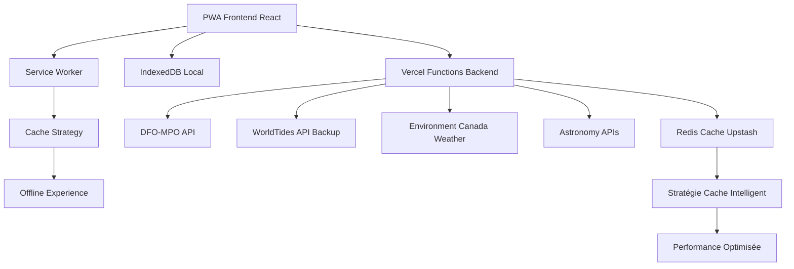
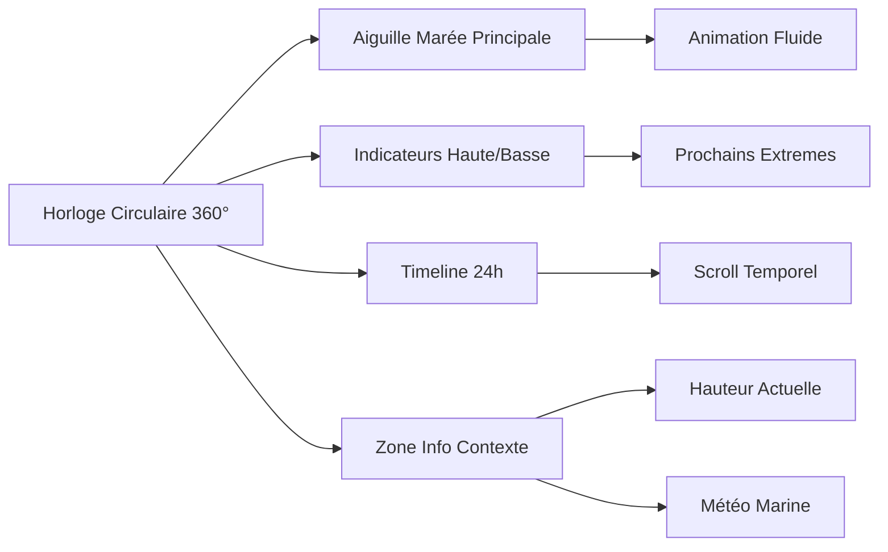

# Document de Planification Final - Horloge des Marées PWA

## Résumé Exécutif

### Vision du Projet
Développement d'une Progressive Web Application (PWA) d'horloge des marées avec interface circulaire "cute" et intuitive, initialement centrée sur Rimouski, Québec, Canada, avec capacité d'extension à d'autres localités. L'application vise à fournir des informations de marées précises, accessibles et visuellement attrayantes dans une interface entièrement française.

### Objectifs Stratégiques
- **Accessibilité**: Interface française intuitive respectant les standards WCAG 2.1 AA
- **Performance**: PWA haute performance avec support hors-ligne complet
- **Fiabilité**: Données de marées précises via APIs gouvernementales canadiennes
- **Extensibilité**: Architecture modulaire permettant l'ajout de nouvelles localités
- **Engagement**: Interface circulaire animée et expérience utilisateur captivante

### Métriques de Succès
- Score Lighthouse ≥ 90 dans toutes les catégories
- Temps de chargement initial < 2 secondes
- Fonctionnalité hors-ligne complète
- Support multi-appareils (mobile-first)
- Conformité accessibility WCAG 2.1 AA

## Architecture Technique

### Stack Technologique Principal
```
Frontend: React 18 + TypeScript + Vite
UI/UX: Tailwind CSS + Framer Motion + SVG custom
State: Zustand + TanStack Query + IndexedDB
Backend: Vercel Functions + Redis (Upstash)
APIs: DFO-MPO Canada (primaire) + WorldTides (backup)
Testing: Jest + React Testing Library + Playwright
Monitoring: Sentry + Analytics privacy-friendly
```

### Architecture Système



### Composants Système Critiques

#### 1. Frontend PWA
- **Interface Circulaire**: SVG custom avec animations Framer Motion
- **Responsive Design**: Mobile-first avec breakpoints adaptatifs
- **Accessibility**: Navigation clavier, lecteurs d'écran, contrastes optimisés
- **Performance**: Code splitting, lazy loading, service worker intelligent

#### 2. Backend Serverless
- **Vercel Functions**: Endpoints API pour données de marées et météo
- **Cache Redis**: Stratégie de cache multi-niveaux avec TTL intelligent
- **Rate Limiting**: Protection contre abus et optimisation coûts
- **Error Handling**: Gestion robuste avec fallbacks multiples

#### 3. Gestion des Données
- **APIs Primaires**: DFO-MPO pour données officielles canadiennes
- **APIs Backup**: WorldTides pour redondance et localités étendues
- **Cache Local**: IndexedDB pour persistence et expérience hors-ligne
- **Calculs Harmoniques**: Prédictions locales en cas d'indisponibilité réseau

## Sources de Données et Intégrations

### APIs de Marées (Priorité 1)
```typescript
// Configuration DFO-MPO (Primaire)
const DFO_CONFIG = {
  baseUrl: 'https://api-iwls.dfo-mpo.gc.ca/api/v1',
  endpoints: {
    stations: '/stations',
    predictions: '/stations/{id}/predictions',
    observations: '/stations/{id}/observations'
  },
  rimouski: {
    stationId: '02680', // Station officielle Rimouski
    name: 'Rimouski, QC',
    coordinates: [48.4379, -68.5256]
  }
}

// Backup WorldTides
const WORLDTIDES_CONFIG = {
  baseUrl: 'https://www.worldtides.info/api/v3',
  rateLimits: '1000 calls/month (free)',
  accuracy: 'Harmoniques globales précises'
}
```

### APIs Complémentaires
- **Météo Marine**: Environment and Climate Change Canada
- **Données Astronomiques**: Sunrise/sunset pour contexte visuel
- **Géolocalisation**: Support localités multiples avec détection automatique

### Stratégie Cache et Performance
```typescript
// Cache Strategy Multi-Niveaux
const CACHE_STRATEGY = {
  predictions: {
    redis: '6 heures',
    indexedDB: '24 heures',
    background_refresh: '2 heures'
  },
  observations: {
    redis: '15 minutes',
    indexedDB: '2 heures',
    real_time: true
  },
  weather: {
    redis: '30 minutes',
    refresh_trigger: 'user_interaction'
  }
}
```

## Design et Expérience Utilisateur

### Interface Circulaire Principale



### Personas et Cas d'Usage

#### Persona 1: Pêcheur Récréatif (Primaire)
- **Besoins**: Prédictions précises, accès hors-ligne, interface rapide
- **Usage**: Consultation matinale, planification sorties, vérification terrain
- **Pain Points**: Connectivité variable, besoin info rapide

#### Persona 2: Plaisancier/Navigateur
- **Besoins**: Données complètes, météo intégrée, planification avancée
- **Usage**: Préparation navigation, surveillance conditions, safety

#### Persona 3: Résident Côtier Curieux
- **Besoins**: Information éducative, interface attrayante, notifications
- **Usage**: Curiosité quotidienne, compréhension phénomènes, partage social

### Spécifications UI/UX Détaillées

#### Composants Interface
```typescript
// Structure Principale
interface TideClockUI {
  circularClock: {
    diameter: 'responsive (280px-400px)',
    center: TideNeedleComponent,
    markers: HourMarkersComponent,
    predictions: TideCurveOverlay
  },
  infoPanel: {
    currentHeight: string,
    nextExtreme: TideExtreme,
    weather: WeatherSummary,
    lastUpdate: timestamp
  },
  navigation: {
    dateSelector: DatePicker,
    locationSelector: LocationPicker,
    settings: SettingsPanel
  }
}
```

#### Thèmes et Accessibilité
- **Thème Principal**: Bleu océan avec accents dorés (lever/coucher soleil)
- **Dark Mode**: Adaptation complète avec contrastes optimisés
- **Responsive**: Mobile-first avec breakpoints 320px/768px/1024px
- **Animations**: Reduce-motion compliant, performances 60fps

## Plan d'Implémentation Détaillé

### Phase 1: MVP Foundation (6-8 semaines)
```
Sprint 1-2: Infrastructure et Setup
├── Configuration projet (Vite + React 18 + TypeScript)
├── Setup Vercel + Redis + CI/CD
├── Intégration DFO-MPO API basique
└── Interface circulaire statique

Sprint 3-4: Fonctionnalités Core
├── Calculs d'angle et positionnement aiguille
├── Données temps réel et prédictions 24h
├── Cache strategy basique (Redis + IndexedDB)
└── Responsive mobile + desktop

Sprint 5-6: PWA et Performance
├── Service Worker et cache strategy
├── Manifest PWA et installation
├── Optimisations performance bundle
└── Tests unitaires et intégration
```

### Phase 2: Enhanced Experience (6-8 semaines)
```
Sprint 7-8: UI/UX Avancé
├── Animations Framer Motion fluides
├── Dark mode et thèmes
├── Feedback utilisateur et micro-interactions
└── Accessibility complet WCAG 2.1

Sprint 9-10: Données Enrichies
├── Intégration météo marine
├── Données astronomiques
├── Historique et tendances
└── Backup API WorldTides

Sprint 11-12: Features Avancées
├── Timeline scrollable 7 jours
├── Notifications intelligentes
├── Partage et exportation données
└── Optimisations performance avancées
```

### Phase 3: Multi-Location (4-6 semaines)
```
Sprint 13-14: Architecture Extensible
├── Système de géolocalisation
├── Sélecteur de localités
├── Configuration stations multiples
└── Cache strategy par location

Sprint 15-16: Expansion Géographique
├── Support côtes Atlantique/Pacifique Canada
├── Integration APIs provinciales
├── Tests localités multiples
└── Documentation utilisateur
```

### Phase 4: Production & Optimization (4-6 semaines)
```
Sprint 17-18: Production Readiness
├── Monitoring et alerting (Sentry)
├── Analytics privacy-compliant
├── Security audit et hardening
└── Documentation complète

Sprint 19-20: Performance & Scale
├── Optimisations bundle avancées
├── CDN et edge caching
├── Load testing et optimisations
└── Maintenance procedures
```

## Spécifications Techniques Critiques

### Performance Requirements
```typescript
// Métriques Cibles Production
const PERFORMANCE_TARGETS = {
  lighthouse: {
    performance: 90,
    accessibility: 95,
    bestPractices: 90,
    seo: 90,
    pwa: 90
  },
  loading: {
    first_contentful_paint: '< 1.5s',
    largest_contentful_paint: '< 2.5s',
    time_to_interactive: '< 3s',
    first_input_delay: '< 100ms'
  },
  offline: {
    cache_coverage: '100% core functionality',
    offline_predictions: '7 days minimum',
    graceful_degradation: 'all features'
  }
}
```

### Data Models Principaux
```typescript
// Structure Données Marées
interface TideData {
  station: {
    id: string;
    name: string;
    coordinates: [number, number];
    timezone: string;
  };
  current: {
    height: number; // metres
    trend: 'rising' | 'falling' | 'slack';
    timestamp: Date;
    confidence: number; // 0-1
  };
  predictions: TidePrediction[];
  extremes: TideExtreme[];
  metadata: {
    lastUpdate: Date;
    source: 'dfo-mpo' | 'worldtides' | 'calculated';
    validity: Date;
  };
}

interface TidePrediction {
  timestamp: Date;
  height: number;
  type: 'prediction' | 'observation';
}

interface TideExtreme {
  timestamp: Date;
  height: number;
  type: 'high' | 'low';
  coefficient?: number; // marée vive-morte
}
```

### Security et Compliance
```typescript
// Configuration Sécurité
const SECURITY_CONFIG = {
  headers: {
    csp: "default-src 'self'; script-src 'self' 'unsafe-inline'",
    xFrameOptions: 'DENY',
    xContentTypeOptions: 'nosniff',
    hsts: 'max-age=31536000; includeSubDomains'
  },
  rateLimit: {
    api: '100 requests/minute/IP',
    static: '1000 requests/minute/IP'
  },
  privacy: {
    analytics: 'no-cookies, privacy-first',
    dataPersistence: 'local-only (IndexedDB)',
    tracking: 'minimal, anonymized'
  }
}
```

## Testing Strategy

### Tests Unitaires (Jest + RTL)
```typescript
// Coverage Targets
const TEST_COVERAGE = {
  statements: 85,
  branches: 80,
  functions: 85,
  lines: 85
};

// Test Categories
const TEST_STRUCTURE = {
  components: 'UI rendering + interactions',
  hooks: 'State management + side effects',
  utils: 'Calculations + data transforms',
  services: 'API calls + cache logic',
  integration: 'End-to-end workflows'
};
```

### Tests E2E (Playwright)
```typescript
// Scénarios Critiques
const E2E_SCENARIOS = [
  'Installation PWA et usage hors-ligne',
  'Navigation interface circulaire',
  'Changement de localité',
  'Responsive mobile/desktop',
  'Performance et accessibility',
  'Gestion erreurs réseau'
];
```

### Tests Performance
- **Lighthouse CI**: Automated performance checks
- **Bundle Analysis**: Monitoring taille et optimisations
- **Real User Monitoring**: Métriques production via Sentry
- **Load Testing**: Stress test APIs et cache behavior

## Déploiement et DevOps

### Pipeline CI/CD
```yaml
# GitHub Actions Workflow
name: Deploy Tide Clock PWA
on:
  push:
    branches: [main, develop]
  pull_request:
    branches: [main]

jobs:
  test:
    runs-on: ubuntu-latest
    steps:
      - uses: actions/checkout@v4
      - uses: actions/setup-node@v4
      - run: npm ci
      - run: npm run type-check
      - run: npm run test:coverage
      - run: npm run test:e2e
      - run: npm run lighthouse:ci

  deploy:
    needs: test
    if: github.ref == 'refs/heads/main'
    runs-on: ubuntu-latest
    steps:
      - uses: actions/checkout@v4
      - uses: vercel/action@v25
        with:
          vercel-token: ${{ secrets.VERCEL_TOKEN }}
          vercel-args: '--prod'
```

### Infrastructure et Monitoring
```typescript
// Configuration Monitoring Production
const MONITORING_CONFIG = {
  sentry: {
    dsn: process.env.SENTRY_DSN,
    environment: process.env.VERCEL_ENV,
    tracesSampleRate: 0.1,
    beforeSend: (event) => filterSensitiveData(event)
  },
  healthChecks: {
    api: '/api/health',
    frequency: '30s',
    timeout: '10s',
    alerts: ['slack', 'email']
  },
  analytics: {
    provider: 'privacy-friendly',
    metrics: ['pageviews', 'user-flows', 'performance'],
    retention: '90 days'
  }
}
```

## Budget et Ressources

### Estimation Coûts Mensuels (Production)
```
Infrastructure:
├── Vercel Pro: ~$20/mois
├── Redis Upstash: ~$10/mois (1GB)
├── S

### Estimation Coûts Mensuels (Production)
```
Infrastructure:
├── Vercel Pro: ~$20/mois
├── Redis Upstash: ~$10/mois (1GB)
├── Sentry Monitoring: ~$26/mois (10k errors)
├── WorldTides API: $0 (1000 calls/mois gratuit)
└── Total Infrastructure: ~$56/mois

APIs Gratuites:
├── DFO-MPO Canada: Gratuit (gouvernemental)
├── Environment Canada: Gratuit (météo)
├── Astronomy APIs: Gratuit (<1000 calls/jour)
└── Total APIs: $0/mois

Développement (estimation):
├── Développeur Full-Stack Senior: 20-28 semaines
├── Designer UX/UI: 4-6 semaines
├── QA/Testing: 4-6 semaines
└── Project Management: Continue
```

### Ressources Humaines Recommandées
```
Équipe Core:
├── Tech Lead / Architecte: 1 personne (full-time)
├── Développeur Frontend React: 1 personne (full-time)
├── Développeur Backend/DevOps: 0.5 personne
├── Designer UX/UI: 0.5 personne
└── QA Engineer: 0.5 personne (phases 2-4)

Skills Techniques Requis:
├── React 18 + TypeScript + Vite expertise
├── PWA et Service Workers
├── Node.js + Serverless (Vercel Functions)
├── Redis et stratégies de cache
├── APIs REST et gestion erreurs
├── Accessibility (WCAG 2.1)
└── Testing (Jest, RTL, Playwright)
```

## Risques et Mitigation

### Risques Techniques Identifiés

#### 1. Disponibilité APIs Gouvernementales
- **Risque**: DFO-MPO API instable ou limites non documentées
- **Impact**: Fonctionnalité core compromise
- **Mitigation**: 
  - API backup WorldTides configurée
  - Cache intelligent avec TTL étendus
  - Calculs harmoniques locaux en fallback
  - Monitoring proactif des APIs

#### 2. Performance Mobile
- **Risque**: Interface circulaire SVG complexe sur mobiles low-end
- **Impact**: Expérience utilisateur dégradée
- **Mitigation**:
  - Progressive enhancement par device capability
  - Fallback interface statique pour devices faibles
  - Animations conditionnelles based on `prefers-reduced-motion`
  - Bundle splitting agressif

#### 3. Complexité Calculs Marées
- **Risque**: Algorithmes harmoniques complexes et sources de bugs
- **Impact**: Données incorrectes, perte confiance utilisateurs
- **Mitigation**:
  - Validation croisée avec sources officielles
  - Tests extensifs avec données historiques
  - Monitoring des écarts prédictions vs observations
  - Documentation claire des sources et méthodes

#### 4. Cache Strategy Complexity
- **Risque**: Synchronisation cache multi-niveaux problématique
- **Impact**: Données incohérentes, performance dégradée
- **Mitigation**:
  - Cache keys strategy documentée
  - TTL configurations testées
  - Cache invalidation patterns clairs
  - Fallback graceful en cas d'échec cache

### Risques Business et Adoption

#### 1. Adoption Utilisateur Limitée
- **Mitigation**: Interface intuitive, onboarding guidé, valeur immédiate
- **Métriques**: Taux installation PWA, retention J7/J30, feedback utilisateur

#### 2. Concurrence Applications Existantes
- **Mitigation**: Différentiation par design et localisation Canadian-specific
- **Avantages**: Interface française, données DFO officielles, offline-first

#### 3. Maintenance Long-terme
- **Mitigation**: Documentation complète, architecture modulaire, monitoring

## Quality Assurance et Success Metrics

### Critères d'Acceptation Phase 1 (MVP)
```typescript
const MVP_ACCEPTANCE_CRITERIA = {
  functional: {
    display_current_tide: 'Hauteur et tendance actuelles',
    display_predictions: '24h prédictions précises',
    offline_capability: 'Fonctionnement sans réseau',
    responsive_design: 'Mobile/desktop support',
    pwa_installation: 'Installation native possible'
  },
  performance: {
    lighthouse_scores: 'Performance ≥85, autres ≥90',
    loading_time: 'FCP <1.5s, LCP <2.5s',
    offline_cache: '24h données disponibles hors-ligne'
  },
  accessibility: {
    wcag_compliance: 'WCAG 2.1 AA conformity',
    keyboard_navigation: 'Navigation clavier complète',
    screen_reader: 'Compatibilité lecteurs écran'
  }
}
```

### KPIs de Succès Production
```typescript
const SUCCESS_KPIS = {
  user_engagement: {
    daily_active_users: 'target: >100 DAU à 3 mois',
    session_duration: 'target: >2 minutes moyenne',
    bounce_rate: 'target: <40%',
    pwa_installation_rate: 'target: >15%'
  },
  technical_performance: {
    api_availability: 'target: >99.5%',
    error_rate: 'target: <1%',
    cache_hit_ratio: 'target: >85%',
    lighthouse_scores: 'target: all >90'
  },
  business_value: {
    user_satisfaction: 'target: >4.5/5 app stores',
    support_requests: 'target: <5/month',
    community_growth: 'target: partage social'
  }
}
```

## Documentation et Références

### Documents de Planification Complets
1. **[Analyse APIs](docs/01-analyse-apis.md)**: Recherche détaillée des sources de données
2. **[Besoins Techniques PWA](docs/02-besoins-techniques-pwa.md)**: Spécifications techniques complètes
3. **[Architecture Système](docs/03-architecture-systeme.md)**: Design architectural détaillé
4. **[UX/UI Experience](docs/04-ux-ui-experience.md)**: Design et expérience utilisateur
5. **[Maquettes Interface](docs/05-maquettes-interface-circulaire.md)**: Spécifications visuelles
6. **[Plan Implémentation](docs/06-plan-implementation-phases.md)**: Roadmap détaillé par phases
7. **[Spécifications Techniques](docs/07-specifications-techniques-detaillees.md)**: Détails implémentation
8. **[Guide Développement](docs/08-guide-developpement-deploiement.md)**: Procédures dev et déploiement

### Ressources Externes Critiques
- **[DFO-MPO API Documentation](https://api-iwls.dfo-mpo.gc.ca/swagger-ui/)**: API principale marées
- **[WorldTides API](https://www.worldtides.info/apidocs)**: API backup
- **[Environment Canada Weather](https://eccc-msc.github.io/open-data/)**: Données météo
- **[WCAG 2.1 Guidelines](https://www.w3.org/WAI/WCAG21/quickref/)**: Standards accessibilité
- **[PWA Best Practices](https://web.dev/progressive-web-apps/)**: Optimisations PWA

### Standards et Conventions
```typescript
// Code Standards
const DEVELOPMENT_STANDARDS = {
  typescript: 'strict mode, no any types',
  react: 'functional components + hooks',
  styling: 'Tailwind CSS + CSS Modules pour custom',
  testing: 'Jest + RTL + Playwright E2E',
  git: 'Conventional commits + feature branches',
  code_review: 'Required avant merge main'
}

// API Standards
const API_STANDARDS = {
  rest: 'RESTful endpoints + OpenAPI spec',
  errors: 'Consistent error responses + codes',
  caching: 'Cache-Control headers appropriés',
  security: 'Rate limiting + input validation',
  monitoring: 'Structured logging + health checks'
}
```

## Prochaines Étapes et Recommandations

### Actions Immédiates Recommandées
1. **Setup Infrastructure**: Créer comptes Vercel, Upstash Redis, Sentry
2. **Prototype API**: Tester intégration DFO-MPO avec quelques endpoints
3. **Design System**: Commencer design tokens et composants de base
4. **Team Assembly**: Recruter ou identifier développeurs avec skills requis

### Décisions Architecturales à Valider
1. **Choix Framework**: Confirmer React 18 vs alternatives (Vue, Svelte)
2. **Stratégie Cache**: Valider approche Redis + IndexedDB avec charge estimée
3. **Testing Strategy**: Confirmer outils et coverage targets
4. **Deployment Strategy**: Finaliser Vercel vs alternatives (Netlify, AWS)

### Validation Concept et Marché
1. **User Research**: Interviews avec pêcheurs/plaisanciers Rimouski
2. **Competitive Analysis**: Audit apps marées existantes Canada
3. **Technical Feasibility**: POC interface circulaire + calculs marées
4. **Performance Baseline**: Tests performance sur devices target

---

## Conclusion

Cette planification complète établit les fondations solides pour développer une PWA d'horloge des marées innovante et techniquement robuste. L'approche par phases permet une validation continue et une gestion des risques optimale.

L'architecture proposée assure scalabilité, performance et maintenance à long terme, while l'accent sur l'accessibilité et l'expérience utilisateur garantit une adoption large.

Le projet est techniquement réalisable avec les ressources et timeline proposés, avec des métriques de succès claires et des stratégies de mitigation des risques bien définies.

**Status**: Prêt pour validation stakeholders et début implémentation Phase 1.